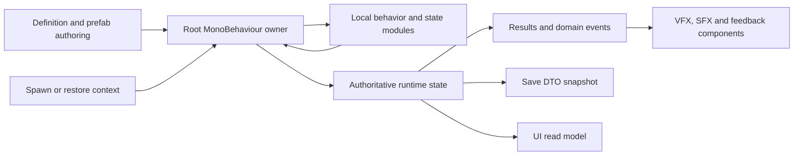
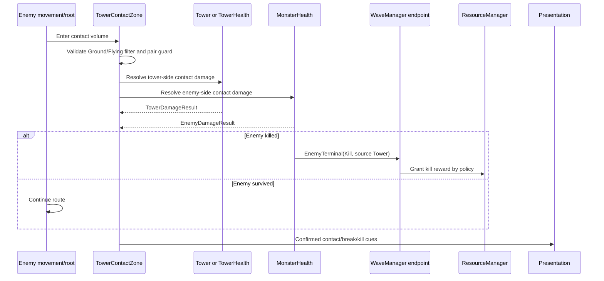

# Gameplay MonoBehaviour component composition

## 1. Назначение и статус

Документ описывает custom `MonoBehaviour`-компоненты, из которых собираются gameplay-сцена и gameplay prefabs Prototype Tower Defence 3D.

Он отвечает на вопросы:

- какая component role должна жить на scene object или prefab;
- какой текущий тип уже реализует эту роль;
- какие Definition, runtime, save и presentation данные компонент использует;
- какие компоненты обязательны, условны или не нужны;
- как root owner общается с локальными modules и gameplay services;
- как authorить prefab topology до Play Mode;
- что сохраняется, пересчитывается и очищается;
- когда новый MonoBehaviour оправдан, а когда нужен field, serializable helper, pure C# object или ScriptableObject.

Логическое имя ниже не требует автоматически создавать одноимённый C#-тип. Сначала расширяется текущий owner chain. Например:

- `DamageReceiver` сейчас может оставаться частью `MonsterHealth` или `PlayerBase`;
- `EnemyLifecycle` может быть idempotent terminal gate внутри `MonsterHealth`, а не новым component;
- `TowerTargeting` может быть plain runtime state/helper внутри `Tower`;
- `TowerDefinitionReference` не нужен, пока `TowerStats.statsSO` и prefab/catalog дают одну Definition identity;
- `GameplayEntity` не нужен только ради общего base class или поля ID.

Текущие code, scene, prefab, assets и serialized references остаются implementation truth. Этот документ задаёт target composition contract для будущих задач.

## 2. Главные правила component architecture

1. **Topology authoring before Play Mode.** Required components и child objects добавляются/удаляются/заменяются в scene/prefab через Unity Editor, PrefabUtility или editor tool до запуска.
2. **Один root owner.** Gameplay object имеет один component, который координирует его lifecycle и authoritative instance state.
3. **Не один component на одно поле.** Состояние остаётся внутри owner, пока у части нет самостоятельного lifecycle, Unity callback, reusable implementation или ясной test boundary.
4. **Definition отдельно.** Shared authored balance/content хранится в ScriptableObject/serializable Definition, а не копируется в каждый prefab component.
5. **Runtime отдельно.** Current HP, target, cooldown, effects и grade принадлежат runtime owner/components, а не Definition asset.
6. **Save отдельно.** MonoBehaviour строит DTO/snapshot; DTO не становится живым component state.
7. **Presentation downstream.** View/cue components отображают подтверждённый result и не решают damage, reward, spend или terminal state.
8. **Явные dependencies.** Same-object dependency кешируется локально; scene/run dependency передаётся composition/spawn initialization, а не ищется leaf-компонентом по сцене.
9. **No runtime repair.** `Awake`, `Start`, launch/rent не добавляют missing component, не удаляют «лишний» component и не строят fallback topology.
10. **No fallback.** Missing required component/reference блокирует initialization/command с явной ошибкой.
11. **Pool symmetry.** Rent/reset/launch/terminal/return очищают runtime state и subscriptions.
12. **Prefab completeness.** Gameplay prefab включает logic, data reference, 3D/presentation, interaction, localization/cues и lifecycle surfaces либо явный `N/A`.

## 3. Когда использовать MonoBehaviour

| Нужда | Правильная форма | Пример |
| --- | --- | --- |
| Transform, Collider, trigger, physics/NavMesh callback | MonoBehaviour | `MonsterMove`, `Projectile` |
| Unity lifecycle и scene/prefab references | MonoBehaviour | `Tower`, `GameplayBootstrap` |
| Один mutable actor state | Root MonoBehaviour или принадлежащий module | `MonsterHealth`, `PlayerBase` |
| Shared authored stats/content | ScriptableObject | `TowerStatsSO`, `MonsterStatsSO`, `WaveConfig` |
| Inline polymorphic rule без Unity lifecycle | `[Serializable]`/`[SerializeReference]` object | `UpgradeRule`, `StatModifier` |
| Формула/validator/scheduler helper | Pure C# object | `TilePlacementValidator` |
| Save/profile/run transfer | Serializable DTO | `TowerSaveDTO`, `RunSaveDTO` |
| UI projection | Immutable ReadModel | `TowerPanelReadModel` |
| One-shot request/result | Command/Result struct/class | `DamagePacket`, `PlacementResult` |
| Unity asset loading/I/O | Service/gateway | Content owner, SaveService |

Новый MonoBehaviour оправдан, если одновременно выполняется хотя бы одна причина:

- нужен собственный Unity callback;
- module переиспользуется на нескольких разных actor roots;
- module можно реально заменить несколькими implementations;
- module имеет отдельный enable/disable/pool lifecycle;
- module владеет самостоятельным runtime state и cleanup;
- module должен иметь собственные serialized scene/prefab references.

Не оправдан:

- только для сокращения файла root owner;
- только как forwarding bridge;
- только как holder одной Definition reference;
- только ради interface без второй implementation;
- только чтобы UI мог найти данные;
- «на будущее» без current consumer/lifecycle.

## 4. Категории custom компонентов

| Категория | Ответственность | Пример | Может менять gameplay state |
| --- | --- | --- | --- |
| Scene composition | Собрать/запустить scene graph | `GameplayBootstrap` | Только startup state |
| Scene/run owner | Владеть частью run | `GameManager`, `WaveManager`, `ResourceManager`, `TileMapManager` | Да, в своей границе |
| Actor root owner | Координировать одну entity | `Tower`, `PlayerBase` | Да, только actor state |
| Actor state module | Владеть частью entity state | `TowerStats`, `MonsterHealth`, `MonsterMove` | Да, через root contract |
| Behavior strategy | Заменяемое поведение | `IWeapon` implementations | Вызывает owner contracts |
| Interaction adapter | Преобразовать input/collision в command | `SelectionSystem`, placement systems | Не обходит owner validation |
| Presentation adapter | Показать state/result | `TooltipWorldBridge`, billboard/VFX/SFX view | Нет authoritative mutation |
| Technical pool marker | Поддержать rent/return | `PrefabSource` | Нет gameplay state |
| Catalog/scene adapter | Связать Unity assets/handles | `TileDatabase`, `NavMeshSurfaceWrapper` | Только catalog/cache state |
| Editor/presentation generator | Создать визуальный asset/preview | `VoxelGenerator`, `TowerPreviewGenerator` | Нет gameplay outcome |

## 5. Общий contract gameplay prefab

Каждый gameplay prefab имеет один root object и предсказуемые child anchors.

```text
GameplayActorRoot
├── Root owner MonoBehaviour
├── Required state modules
├── Required Unity components
├── Optional behavior strategies
├── Optional effect/interaction modules
└── VisualRoot
    ├── Renderers/voxel/sprite representation
    ├── authored sockets/anchors
    ├── local VFX/SFX emitters
    └── optional selection/tooltip visuals
```

### 5.1 Root owner

Root owner:

- принимает spawn/restore context;
- валидирует локальные modules;
- хранит EntityId только если он реально нужен registry/save;
- владеет terminal/active flag;
- маршрутизирует commands к локальным modules;
- строит actor snapshot/read model;
- публикует domain results после commit;
- выполняет cleanup.

Root owner не:

- читает ProfileSave;
- загружает Definitions через `Resources.Load` для каждого instance;
- ищет run services по сцене;
- добавляет missing modules;
- копирует state sibling component;
- передаёт gameplay authority view/VFX/SFX.

### 5.2 Локальные modules

Hard same-object dependencies:

- авторятся на prefab;
- при необходимости декларируются `[RequireComponent]`;
- кешируются через `GetComponent/TryGetComponent` только на том же root;
- валидируются до activation;
- не ищутся повторно каждый frame.

Child dependencies (`Muzzle`, range visual, socket, renderer root) передаются serialized `Transform`/component references. Поиск по имени допустим только в editor migration/tool, не как runtime contract.

### 5.3 Initialization

Логические contexts, не обязательные новые типы:

```text
TowerSpawnContext
├── EntityId
├── TowerDefinition/ContentId
├── Position/rotation
├── Grade/branch/modifiers
├── Economy/map command endpoints
└── Run cancellation/random context

EnemySpawnContext
├── EntityId
├── EnemyDefinition/ContentId
├── WaveInstanceId/lane
├── Spawn/base path handles
├── Scaled stats/modifiers
├── Terminal endpoint
└── Run/wave cancellation context

ProjectileLaunchContext
├── Source/attack sequence IDs
├── DamagePacket
├── Origin/direction/target snapshot
├── Speed/lifetime/hit policy
└── Pool return endpoint
```

Для текущего простого prefab прямые method parameters достаточны. Context object вводится, когда параметров и restore paths становится достаточно много; он не является новым state owner.

## 6. Data boundaries внутри компонента

| Data context | Где хранится | Что делает MonoBehaviour |
| --- | --- | --- |
| Definition | ScriptableObject/prefab serialized config/catalog | Хранит read-only reference/ContentId |
| Runtime state | Root/module fields или owned plain object | Единолично меняет в своей границе |
| Derived values | Stats/cache fields | Пересчитывает из Definition + modifiers |
| Save | DTO вне live object | Строит/применяет snapshot через owner |
| Command | Immutable input одного вызова | Валидирует и применяет атомарно |
| Event/Result | Immutable output | Публикует после mutation |
| ReadModel | Immutable projection | Строит для UI/inspect |
| Cue | Semantic presentation request | Передаёт VFX/SFX owner’у |
| Editor preview | Editor-only/generated asset state | Не влияет на runtime truth |

Общий поток:



## 7. Текущий custom MonoBehaviour inventory

| Текущий component | Живёт на | Текущая роль | Target contract |
| --- | --- | --- | --- |
| `GameplayBootstrap` | Gameplay scene root | Startup sequence | Единственный executable scene entry point |
| `GameManager` | GameLoop scene object | GameState, terminal, pause/start gate | Global run transition owner |
| `WaveManager` | GameLoop scene object | Spawn/wave/inter-wave flow | Wave runtime owner |
| `ResourceManager` | GameLoop scene object | Run currency | Run economy owner; без meta state |
| `LevelGenerator` | Level scene object | Initial map generation | Передаёт committed map TileMapManager |
| `TileMapManager` | Level scene object | Topology/spawn positions | Единственный map runtime owner |
| `TilePlacementSystem` | Level/interaction object | Tile draft/input/commit | Placement draft owner |
| `NavMeshSurfaceWrapper` | NavMesh object | Derived NavMesh build | Build/validation adapter |
| `TileDatabase` | Catalog object | Tile prefab lookup | Текущий tile catalog owner |
| `TowerPlacementSystem` | Interaction object | Tower preview/purchase | Atomic placement command owner |
| `TowerPreviewGenerator` | UI/preview object | Runtime tower icon render | Перенести к editor-generated icon pipeline |
| `Tower` | Tower prefab root | Target/fire/upgrade/sell/select | Tower actor root owner |
| `TowerStats` | Tower prefab root | Definition stats + derived values/grade | Tower state module |
| `InstantWeapon`, `BeamWeapon`, `AoEWeapon`, `PierceWeapon` | Tower root/child | `IWeapon` strategies | Delivery module; receiver owns damage |
| `MonsterStats` | Enemy prefab root | Definition stats + modifiers | Enemy derived stats module |
| `MonsterHealth` | Enemy prefab root | HP/reward/death | HP + typed terminal gate target |
| `MonsterMove` | Enemy prefab root | NavMesh movement/leak trigger | Movement module; reports Leak terminal |
| `Targetable` | Enemy/other selectable root | Generic selection callback | Optional interaction adapter |
| `PlayerBase` | Base prefab root | HP/repair/destroyed | Base actor root/receiver owner |
| `Projectile` | Projectile prefab root | Flight/collision/impact | Impact-once delivery actor |
| `PrefabSource` | Pooled instance | Pool prefab key | Authored pool marker либо pool-owned map |
| `RoadTileComponent` | Tile prefab root | Road connection presentation/data | Tile instance adapter |
| `VoxelGenerator` | Tower/Enemy/Tile/Base visuals | Procedural mesh generation | Editor/authored visual pipeline for gameplay prefabs |
| `DirectionalSpriteBillboard` | Sprite visual root | Directional visual selection | Presentation-only |
| `SpriteResolverSockets` | Sprite visual root | Authored socket transforms | Presentation/attachment adapter |
| `SpriteShadowCaster3D` | Sprite visual root | 3D shadow mesh | Presentation-only; authored child topology |
| `TooltipWorldBridge` | Selectable actor | World → UI tooltip bridge | Presentation adapter, not data owner |
| `SelectionSystem` | Scene interaction root | Hover/selection input | Selection presentation/input owner |
| `GameHUD`, `WaveUI`, `TowerShopUI` | Canvas | Commands/read display | UI views/controllers |
| `RTSCameraController`, input provider | Camera rig | Camera/input behavior | Presentation/input, не gameplay state |

Synthetic input tools, editor inspectors и package components не входят в gameplay prefab contract.

## 8. Scene root composition

### 8.1 Минимальная gameplay-сцена

```text
GameplayRoot
└── GameplayBootstrap

GameLoop
├── GameManager
├── WaveManager
└── ResourceManager

Level
├── LevelGenerator
├── TileMapManager
├── TilePlacementSystem
├── TileDatabase
└── NavMeshSurfaceWrapper + Unity NavMeshSurface

Interaction
├── TowerPlacementSystem
├── SelectionSystem
└── CameraRig
    ├── RTSCameraController
    └── InputProvider_NewInputSystem

Actors
├── PlayerBase instance
├── Towers parent
├── Enemies parent
├── Projectiles/pools
└── generated SpawnAnchors

Canvas
├── GameHUD
├── WaveUI
├── TowerShopUI
└── Tooltip/pause/settings views
```

`GameplayBootstrap` получает required scene owners serialized references или через один scene composition context. Остальные components не создают второй startup flow.

### 8.2 Scene owner initialization order

1. scene/prefab topology уже существует;
2. local `Awake` только кеширует same-object components и устанавливает безопасное initial state;
3. GameplayBootstrap валидирует required references;
4. map generation/restore;
5. NavMesh build;
6. PlayerBase/spawn handles;
7. Resource/Wave/Game owners initialize;
8. UI/presentation subscribe;
9. GameManager входит в Preparation.

Scene owner не должен полагаться на execution order разных `Start` methods вместо явной bootstrap sequence.
## 9. Tower prefab recipe

### 9.1 Basic required composition

Representative current base prefab `Tower_00 Novice` already содержит project-owned components `Tower`, `TowerStats`, `VoxelGenerator`, `TooltipWorldBridge` и weapon reference/implementation chain. Tower variants могут наследовать base prefab и переопределять stats/weapon/visual config.

```text
TowerRoot
├── Tower                         // root owner
├── TowerStats                    // Definition + derived combat stats + grade
├── exactly one IWeapon module    // Instant/Beam/AoE/Pierce/projectile route
├── TooltipWorldBridge            // если объект selectable/inspectable
├── Collider/physics setup        // authored Unity components
└── VisualRoot
    ├── VoxelGenerator OR sprite representation
    ├── Muzzle/Weapon socket Transform(s)
    ├── RangeVisual
    └── local fire/upgrade/sell cue objects
```

### 9.2 Tower — root owner

**Definition inputs:** TowerStatsSO, tower identity/catalog entry, weapon/projectile references, upgrade rules, localization/presentation references.

**Runtime owns:**

- active/terminal lifecycle;
- current target and target policy;
- attack cooldown/fire sequence;
- grade/branch coordination;
- selected state hooks;
- upgrade/sell transaction entry points;
- optional EntityId and run modifiers.

**Knows locally:** TowerStats, one IWeapon, muzzle/origin transforms, presentation references.

**Knows externally:** narrow map occupancy/economy/target query endpoints supplied by placement/spawn composition when those contracts are implemented.

**Does not own:** run currency, enemy HP, map topology, ProfileSave, global selection UI.

**Save:** TowerSaveDTO: ContentId, position/rotation, grade/branch, target policy, persistent modifiers. Current target/cooldown сохраняются только при Deferred mid-wave save.

### 9.3 TowerStats

`TowerStats : ComponentStats<TowerStatsSO>` остаётся owner derived stats и current grade.

- `statsSO` — read-only Definition reference;
- `Damage`, `FireRate`, `Range`, `CritChance`, `ProjectileSpeed`, `RotateSpeed`, `UpgradeCost` — derived runtime values;
- modifiers принадлежат runtime stats instance;
- Definition asset не мутируется при upgrade одной Tower;
- Save хранит grade/branch/modifier IDs, а derived values пересчитываются после restore;
- UI читает TowerReadModel, а не меняет `Stat` напрямую.

Не создавать отдельные `DamageComponent`, `RangeComponent`, `FireRateComponent` только для чисел.

### 9.4 Weapon module

На Tower активен ровно один primary `IWeapon` delivery module, если дизайн явно не предусматривает несколько независимых hardpoints.

Weapon component хранит:

- geometry/collision/delivery config, специфичный implementation;
- ссылки на tracer/beam/projectile prefab/muzzle presentation;
- краткоживущий fire/beam state;
- cleanup active effects.

Weapon получает `AttackContext/DamagePacket` от Tower и передаёт его receiver’у. Он не читает TowerStats через повторный scene search, не начисляет reward и не вызывает ResourceManager.

Варианты:

- **InstantWeapon:** raycast/hitscan delivery;
- **BeamWeapon:** duration/tick delivery;
- **AoEWeapon:** area tick delivery;
- **PierceWeapon:** ordered multi-hit delivery;
- **Projectile route:** Tower rents/launches Projectile.

Если shared damage formula становится общей, она остаётся pure helper/packet builder у Tower/weapon chain, а не новым global CombatManager.

### 9.5 Targeting

Basic targeting остаётся внутри `Tower` как fields + pure policy logic.

Отдельный `TowerTargeting` MonoBehaviour оправдан только если:

- разные towers заменяют sensor implementations;
- sensor имеет собственные triggers/physics callbacks;
- sensor lifecycle/pooling отличается от Tower;
- targeting переиспользуется другими actor types.

Даже после extraction Tower остаётся owner current target/attack decision; sensor возвращает candidates/query result.

Target priority (`Nearest`, `Farthest`, `Strongest`, `Weakest`) — Definition/runtime enum/policy, не component topology.

### 9.6 Tower interaction/presentation

- `Tower` уже реализует `ITargetable` и `ITooltipValues`; дополнительный generic `Targetable` на том же root обычно не нужен.
- `TooltipWorldBridge` показывает read-only title/description/actions.
- range visual остаётся serializable helper/child reference (`TowerStatsVisual` сейчас plain `[Serializable]` object), а не обязательным MonoBehaviour.
- VFX/SFX emitters могут быть child components, если им нужен lifecycle/pool; иначе достаточно UnityEvent/cue mapping у view.
- `DirectionalSpriteBillboard`, `SpriteResolverSockets`, `SpriteShadowCaster3D` используются только для sprite representation variant.

### 9.7 Conditional Tower components

| Logical role | Suggested type only if extraction justified | Когда нужен | Владеет | Не владеет |
| --- | --- | --- | --- | --- |
| Damage receiver | `TowerHealth`/receiver inside Tower | Enemies могут атаковать Tower | Tower HP/terminal | Base/enemy HP |
| Shield | `ShieldController` | Shield имеет regen/break/typed absorption и переиспользуется | Shield runtime state | HP/reward |
| Status effects | `StatusEffectController` | Несколько stackable timed effects | Effect instances | Definition assets |
| Aura source | `AuraEmitter` | Tower даёт area modifiers | Source radius/target membership | Target stats owner |
| Ability | `TowerAbility` implementation | Player/auto ability с отдельным cooldown/input | Ability runtime | Tower base attack |
| Cue emitter | `TowerCueEmitter` | Data-driven/shared cue routing | Presentation handles | Attack outcome |
| Multiple hardpoints | `WeaponMount` | Несколько independently firing weapons | Mount geometry/local fire state | Tower global target policy unless specified |

Если shield/status/aura существуют только у одного Tower и просты, они могут оставаться fields/owned plain objects внутри Tower.

### 9.8 Tower placement preview

Placement preview — отдельный authored presentation prefab/component topology, а не clone реальной Tower с runtime удалением behavior components.

```text
TowerPlacementPreview
├── authored Rigidbody/Collider/Trigger setup if required
├── TriggerIntersectColor or replacement validation view
├── PreviewVisual reference
└── no Tower combat/weapon/stats owner components
```

Preview получает PlacementReadModel: transform, footprint, valid/invalid reason, cost availability. Он не выполняет spend и не создаёт authoritative Tower.

### 9.9 Tower prefab variants

Variant меняет только:

- TowerStatsSO;
- IWeapon implementation/config;
- projectile/beam/tracer references;
- visual generation/profile/material/palette;
- localization/presentation/cue references;
- optional conditional modules, если механика действительно другая.

Variant не добавляет второй Tower root owner, второй stats owner или дублирующую валюту.

## 10. Enemy prefab recipe

### 10.1 Basic required composition

Representative current `Monster.prefab` содержит `MonsterStats`, `MonsterHealth`, `MonsterMove`, `Targetable`, `TooltipWorldBridge`, `VoxelGenerator` и Unity NavMesh/physics components.

```text
EnemyRoot
├── MonsterStats
├── MonsterHealth                 // HP + target terminal gate
├── MonsterMove                   // NavMesh movement, reports Leak
├── Targetable                    // если inspectable/selectable
├── TooltipWorldBridge            // если показывается tooltip
├── NavMeshAgent
├── Collider/physics setup
└── VisualRoot
    ├── VoxelGenerator OR sprite representation
    └── spawn/hit/death/leak cue objects
```

### 10.2 MonsterStats

`MonsterStats : ComponentStats<MonsterStatsSO>` хранит derived runtime values:

- Damage/leak contribution;
- MoveSpeed;
- Health;
- InstantReward;
- IncomeReward;
- EarlyKillModifier;
- current grade/modifiers, если используются.

MonsterStatsSO остаётся shared Definition. Wave scaling/challenge modifiers применяются к instance values/context, а не записываются обратно в asset.

### 10.3 MonsterHealth — HP и terminal gate

Target contract:

- владеет current/max HP;
- принимает DamagePacket/Heal/Effect commands;
- гарантирует одну terminal transition;
- различает `Kill`, `Leak`, `DespawnByRunEnd`;
- публикует EnemyTerminalResult один раз;
- kill reward eligibility следует из terminal result/Definition, а не из VFX callback;
- сообщает target/read model dirty после изменения HP/effects.

Текущий `onDeath` должен эволюционировать в typed terminal path внутри существующего owner chain. Отдельный `EnemyLifecycle` component не нужен, если MonsterHealth может безопасно стать этой gate.

### 10.4 MonsterMove

MonsterMove владеет:

- NavMeshAgent handle;
- current movement speed/path state;
- base destination handle;
- stopped/moving state;
- reach-base detection.

Он не:

- уменьшает WaveManager alive count напрямую;
- выдаёт reward;
- вызывает generic death event как замену Leak;
- ищет PlayerBase при каждом instance spawn.

Base/path/terminal endpoints передаются EnemySpawnContext или explicit initialize. При достижении базы MonsterMove отправляет `TryTerminate(Leak)` root/health gate, затем terminal result маршрутизируется PlayerBase/WaveManager.

### 10.5 Targetable и tooltip

Generic `Targetable` подходит Enemy, если root owner сам не реализует selection contract. Он хранит только selection dirty/presentation callbacks.

Enemy inspect data строится из MonsterHealth/MonsterStats read model. `Targetable` и `TooltipWorldBridge` не становятся owners HP, traits или localization content.

### 10.6 Conditional Enemy components

| Logical role | Suggested type | Когда нужен | Runtime state |
| --- | --- | --- | --- |
| Shield | `ShieldController` | Shield absorption/regen/break | Current shield, cooldown, broken state |
| Armor/resistance | owned data or `ResistanceController` | Dynamic resistances/equipment/effects | Effective resistance cache |
| Status effects | `StatusEffectController` | Timed/stacked slows, burns, marks | Active instances |
| Aura | `AuraEmitter` | Enemy buffs nearby enemies | Source membership/refresh |
| Ability | `EnemyAbility` implementation | Heal, split, summon, teleport | Cooldown/cast state |
| Spawn/death presentation | `EnemyCueEmitter`/view | Shared data-driven cues | Presentation handles only |
| Boss phase | owned state or `BossPhaseController` | Independent phase graph/lifecycle | Current phase/transition guard |

Simple armor multiplier stays in MonsterHealth/resistance profile. Отдельный component нужен только при dynamic state/lifecycle.

### 10.7 Enemy variants

Prefab variant может менять MonsterStatsSO, visuals, size/NavMeshAgent settings, optional ability/aura/shield modules и cues. Он не удаляет required health/movement/terminal chain.

Boss prefab variant должен наследовать complete Enemy composition либо явно иметь собственный full root recipe; пустой variant override не заменяет base component validation.

## 11. PlayerBase prefab recipe

### 11.1 Basic composition

```text
PlayerBaseRoot
├── PlayerBase                    // root HP/repair/destroyed owner
├── authored Rigidbody
├── authored Collider
├── TooltipWorldBridge            // если inspectable
└── VisualRoot
    ├── VoxelGenerator OR authored model/sprite
    └── damage/repair/destroyed cue objects
```

`[RequireComponent]` может выражать hard Rigidbody/Collider invariant, но prefab всё равно authorится полным до Play Mode.

### 11.2 PlayerBase contract

**Definition:** max HP, leak/damage/shield rules, visuals/cues.

**Runtime:** current HP/shield, destroyed-once flag, repair state.

**Commands:** apply leak damage, repair, restore.

**Outputs:** DamageResult, health changed read model/event, BaseDestroyed terminal result.

**Save:** current HP/shield и persistent modifiers. Collider/Rigidbody/NavMesh/visual handles не сохраняются.

PlayerBase не переводит GameState самостоятельно; `BaseDestroyed` принимает GameManager.

### 11.3 Conditional components

- `ShieldController` — если shield полноценный и shared с Enemy/Tower;
- `StatusEffectController` — если база может гореть, быть disabled или получать timed effects;
- `BaseAuraEmitter` — если база усиливает towers;
- `BaseRepairInteraction` — только если repair имеет world interaction, отличный от HUD command;
- `BaseCueEmitter` — если presentation routing сложнее локальных events.

## 12. Projectile prefab recipe

### 12.1 Basic composition

```text
ProjectileRoot
├── Projectile                    // flight/impact-once owner
├── authored pool identity OR pool-owned external map
├── authored Collider if collision callbacks require it
└── VisualRoot
    ├── Mesh/Sprite/TrailRenderer
    └── launch/impact/dissipate cue objects
```

### 12.2 Projectile contract

**Definition/config:** mode, radius, area policy, lifetime, visual/cues. Shared projectile config может стать ProjectileDefinition при catalog/mod reuse.

**Launch runtime:** source/attack IDs, immutable DamagePacket, origin, direction, target snapshot/reference policy, speed, remaining lifetime, hasHit.

**Lifecycle:** rent/create → reset → launch → move → exactly one hit/expire → clear trail/target/packet → return/destroy.

Projectile:

- не владеет target HP;
- не начисляет reward;
- не сообщает WaveManager напрямую;
- не оставляет previous launch state после pool return;
- не вызывает damage дважды при нескольких collision paths.

### 12.3 Pool identity

Текущий pool добавляет `PrefabSource` при runtime creation. Target варианты:

1. `PrefabSource/PoolIdentity` уже authored на projectile prefab; или
2. pool хранит instance → source mapping внутри себя без добавления component.

Не добавлять marker через `AddComponent` при rent/launch.

### 12.4 Projectile variants

Instant damage не обязан создавать Projectile GameObject. Beam/instant/pierce могут оставаться weapon modules. Projectile prefab нужен только для поведения с самостоятельным spatial/lifetime state.

## 13. Road tile prefab recipe

### 13.1 Basic composition

```text
RoadTileRoot
├── RoadTileComponent             // Unity instance adapter
├── authored Collider/build surface geometry
└── VisualRoot
    └── VoxelGenerator OR authored mesh/sprite
```

`RoadTileComponent` хранит connection representation для конкретного prefab/instance и отдаёт её TileMapManager/generation pipeline.

Authoritative runtime topology остаётся в TileMapManager/TilePlacementValidator; tile component не ведёт второй глобальный map dictionary.

### 13.2 Data mapping

- Definition: RoadTileDef/TileDefinition, connection pattern, prefab, build rules, localization/presentation;
- runtime: grid position/rotation/instance handle у TileMapManager;
- save: ContentId/grid/rotation/occupancy в MapSaveDTO;
- presentation: geometry, placement preview, tile icon;
- derived: open ends/spawn anchors/NavMesh.

### 13.3 Conditional tile components

| Role | Когда отдельный component оправдан |
| --- | --- |
| `TowerBuildSurface`/socket marker | Несколько разных build zones/height/footprints на одном tile |
| `SpawnAnchorView` | Anchor имеет lane/visual/debug metadata; generated snapshot остаётся owner data |
| `TileAuraZone` | Tile даёт runtime area modifier с enter/exit lifecycle |
| `TileHazard` | Hazard имеет tick/targets/cues и самостоятельный runtime state |
| `TileInteraction` | Игрок взаимодействует с world tile, а не только placement UI |
| `TileCueEmitter` | Data-driven place/rotate/invalid feedback |

Если tile является однородной build surface, отдельный marker не нужен: geometry/query остаются TileMapManager/RoadTileComponent contract.

### 13.4 Tile placement preview

Tile ghost/preview должен иметь authored visual/collider topology и только presentation/validation adapters. Он не содержит authoritative TileMapManager и не мутирует RoadTileDef asset.

## 14. Selection, tooltip и world interaction composition

### 14.1 SelectionSystem

Scene-level owner:

- читает Input System actions;
- выполняет ray/sphere query;
- хранит current hovered/selected reference;
- вызывает `ITargetable.OnSelected/OnDeselected`;
- управляет selection presentation/read model binding.

Он не меняет Tower/Enemy stats и не хранит Save state. При actor terminal/destroy selection очищается.

### 14.2 ITargetable

Interface оправдан несколькими selectable object types. Component shape:

- Tower реализует interface root owner’ом;
- Enemy может использовать generic `Targetable` adapter;
- PlayerBase может реализовать root owner’ом или generic adapter;
- не ставить одновременно root implementation и generic Targetable на один object.

### 14.3 TooltipWorldBridge

Это presentation adapter:

- получает ITooltipValues/read model;
- связывает world bounds с UI tooltip;
- не рассчитывает upgrade/sell eligibility самостоятельно;
- button action отправляет owner command;
- proxy UI topology должна быть authored/poolable, а не собираться через `AddComponent` в `Awake`.

### 14.4 Placement interaction components

`TowerPlacementSystem`, `TilePlacementSystem`, `TriggerIntersectColor` и preview views образуют command/presentation chain.

- placement system владеет draft;
- map/economy owners подтверждают command;
- `TriggerIntersectColor` только показывает collision/validity result;
- preview green/red color не является final validation;
- cancel уничтожает только preview instance, не authoritative gameplay object.

## 15. Visual, VFX и SFX components

### 15.1 Visual representation alternatives

Для одного object выбирается одна основная authored representation:

- voxel/mesh: `VoxelGenerator` + generated/authored mesh children;
- directional sprite: `DirectionalSpriteBillboard` + SpriteResolvers + optional sockets/shadow;
- ordinary prefab model/Animator;
- hybrid только при явном visual design.

Gameplay owner зависит от abstract anchors/render roots, но не от конкретной generation formula.

### 15.2 VoxelGenerator

`VoxelGenerator` является visual generation component, не gameplay state owner.

Target authoring:

- gameplay prefabs получают complete `Combined`/MeshFilter/MeshRenderer/MeshCollider topology до Play Mode;
- editor action генерирует/обновляет/встраивает meshes/materials;
- runtime может менять existing mesh/material values, если это design requirement;
- runtime generation не добавляет child components как repair path;
- generated visuals не определяют range, collision damage, reward или save identity.

### 15.3 Directional sprite components

- `DirectionalSpriteBillboard` выбирает visual direction по camera/sun;
- `SpriteResolverSockets` обновляет authored `Socket_*` transforms;
- `SpriteShadowCaster3D` обновляет existing authored shadow mesh child;
- все они presentation-only и не сохраняются;
- sockets используются weapon/VFX attachments, но не становятся Tower state owner.

### 15.4 Cue emitters

Local cue component оправдан, если у prefab есть несколько semantic events и reusable assets/pool handles.

```text
Domain Result
  → actor view/cue emitter
  → VfxCueRequest/SfxCueRequest
  → local/shared player
```

Cue component хранит references/handles и presentation lifecycle. Он не подтверждает hit, kill, spend, reward, tile placement или upgrade.

### 15.5 Icon generation

Gameplay icon не требует runtime MonoBehaviour на actor. `TowerPreviewGenerator`-подобная роль должна работать как editor content pipeline:

- instantiate prefab in editor preview scene;
- render from complete 3D representation;
- save/import icon asset;
- catalog/Definition references icon;
- runtime UI только показывает asset.

Runtime-generated Texture2D cache допустим как prototype, но не является persistent content/source of truth.
## 16. Road-contact Tower: Enemy погибает или ломает Tower

### 16.1 Статус механики

Это conditional Tower composition для башен/ловушек, которые ставятся непосредственно на дорогу. Они **не блокируют route и не меняют NavMesh**. Ground Enemy продолжает обычный путь и входит в authored contact trigger; результат контакта определяет, погиб Enemy, сломалась Tower или повреждены оба.

Инварианты:

1. road-contact Tower не создаёт invalid path и не требует repath/NavMesh rebuild;
2. contact обрабатывается idempotent для пары Tower/Enemy/attack sequence;
3. Enemy terminal остаётся typed `Kill/Leak`, Tower terminal — `Broken/Destroyed` с причиной;
4. kill reward выдаётся по confirmed Enemy Kill, а не по trigger callback;
5. сломанная Tower перестаёт наносить contact effect и стрелять;
6. optional restoration имеет одного owner и не требует глобального RepairManager;
7. Ground/Flying filters применяются до contact result;
8. monster-caused break не выдаёт sell refund.

### 16.2 Prefab composition

```text
RoadContactTowerRoot
├── Tower                         // общий root owner
├── TowerStats
├── IWeapon module?               // optional: Tower может также стрелять
├── TowerHealth                   // required для HP/broken state
├── TowerContactZone              // authored trigger/contact adapter
├── TowerAutoRepair?              // optional owned repair lifecycle
├── authored Collider/Trigger
├── authored Rigidbody only if physics setup requires it
├── TooltipWorldBridge
└── VisualRoot
    ├── ActiveVisual
    ├── Damaged/BrokenVisual
    ├── contact/break/restore VFX/SFX
    └── optional health/repair world UI
```

`TowerHealth`, `TowerContactZone` и `TowerAutoRepair` — suggested names. Не создавать все три автоматически:

- если Tower всегда погибает от первого контакта, broken state может принадлежать `Tower`, а отдельный TowerHealth не нужен;
- если contact имеет собственный trigger/debounce/filter lifecycle, `TowerContactZone` оправдан как MonoBehaviour;
- если repair — одно простое поле/таймер одной Tower, он может жить внутри TowerHealth;
- `TowerAutoRepair` выделяется при нескольких repair modes, damaged/broken state, pause/resume и shared reuse.

### 16.3 Definition data

```text
Road-contact Tower fields
├── PlacementCategory: OffRoad | RoadContact | Either
├── ContactTargetFilter: Ground | Flying | Both
├── ContactResolutionPolicy
│   ├── InstantKillEnemy
│   ├── InstantBreakTower
│   ├── ComparePower
│   ├── MutualDamage
│   └── DamageEnemyThenTower
├── TowerMaxHealth?
├── ContactDamageToEnemy
├── ContactDamageToTower
├── ContactCooldownPerEnemy
├── OneContactPerEnemy?
├── EnemyFilter/Tags/Roles
├── BrokenBehavior
│   ├── DisableWeapon
│   ├── DisableContact
│   ├── KeepBrokenVisual
│   └── RemoveInstance
├── AutoRepairMode
│   ├── None
│   ├── BetweenWavesFull
│   ├── BetweenWavesAmount
│   ├── InWaveAfterDelay
│   └── InWaveRegeneration
├── AutoRepairDelay
├── AutoRepairRate/Amount
├── CanRebuildFromBroken
├── ResetRepairDelayOnContact
├── PaidRepairCost?              // отдельная player command policy
├── DestroyedRefundPolicy       // monster break: none
├── Ground/Flying contact volume refs
├── Contact/break/repair CueIds
└── Localized gameplay tooltip
```

Баланс хранится в TowerDefinition/TowerStatsSO-linked config. Runtime HP/timers не записываются в Definition и не дублируются в UI.

### 16.4 Runtime ownership

**Tower/TowerHealth owns:**

- current/max HP;
- `Active | Damaged | Broken | Restoring` state;
- terminal/broken-once guard;
- weapon/contact enabled policy;
- repair eligibility;
- TowerDamageResult/TowerBroken/TowerRestored events;
- snapshot/read model.

**TowerContactZone owns:**

- authored trigger references;
- Ground/Flying/layer/role filters;
- active contact pair IDs/cooldowns;
- преобразование trigger callback в ContactCommand;
- отключение contact при Broken;
- presentation cue request после confirmed result.

**TowerAutoRepair или TowerHealth-owned repair state owns:**

- delay/rate/progress;
- current repair mode;
- subscription на wave phase/state;
- pause/reset по damage/contact policy;
- restore-from-broken transition.

**Enemy owner owns:** HP, typed terminal Kill, movement продолжение и собственный contact state.

`TowerContactZone` не меняет Enemy HP/Tower HP напрямую произвольными field writes. Он вызывает receiver contracts и получает typed results.

### 16.5 ContactResult

```text
TowerEnemyContactResult
├── CorrelationId/ContactSequenceId
├── TowerEntityId
├── EnemyEntityId
├── EnemyMovementDomain
├── EnemyDamageResult
├── TowerDamageResult
├── EnemyOutcome: Survived | Kill
├── TowerOutcome: Active | Damaged | Broken
├── KillRewardEligibility/Source
└── Cue payload
```

Возможные исходы:

| Enemy | Tower | Следствие |
| --- | --- | --- |
| Kill | Active/Damaged | EnemyTerminal(Kill), reward по policy; Tower остаётся |
| Survived | Broken | Tower contact/weapon выключаются; Enemy продолжает путь |
| Kill | Broken | Mutual destruction; оба terminal results применяются один раз |
| Survived | Damaged | Enemy проходит дальше; Tower может repair |

Если design требует, чтобы Enemy задерживался и бил Tower несколько раз, это уже отдельная contact-attack mechanic. В текущем запросе default — **не блокировать**: contact разрешается и выживший Enemy продолжает путь.

### 16.6 Contact sequence



Order damage mutations задаётся ContactResolutionPolicy, но external consumers получают один aggregate ContactResult. Repeat trigger не создаёт второй reward или break.

### 16.7 Placement и navigation

TowerPlacementSystem для road-contact Tower:

1. проверяет `PlacementCategory` и road surface;
2. валидирует footprint/overlap и contact volume;
3. проверяет Ground/Flying support;
4. создаёт complete prefab;
5. регистрирует Tower occupancy как gameplay object, но **не закрывает road graph**;
6. не добавляет `NavMeshObstacle.carving` и не вызывает NavMesh rebuild ради Tower;
7. применяет spend атомарно;
8. публикует TowerPlaced/read model/cues.

Contact volume должен быть trigger/interaction geometry, не permanent path obstacle. Ground NavMesh route к Base остаётся тем же до и после placement/break.

### 16.8 Broken state и удаление

Broken Tower может иметь два lifecycle variants:

- **RemoveOnBreak:** unregister occupancy/auras/selection, destroy/return prefab; auto rebuild невозможен без отдельного saved run owner/factory command.
- **RemainBroken:** root остаётся на сцене, weapon/contact/auras disabled, показывается BrokenVisual; repair может вернуть Active.

Для optional auto restoration рекомендуется `RemainBroken`, потому что component с таймером/phase subscription должен продолжать существовать.

Broken Tower не участвует в targeting как active defense и не наносит contact damage. Может оставаться selectable для tooltip/manual repair/sell scrap, если design это разрешает.

### 16.9 Auto restoration между волнами

`BetweenWavesFull/Amount` выполняется на подтверждённом переходе WaveResolve → Preparation:

```text
WaveResolved
  → GameManager enters WaveResolve
  → Tower repair owner receives phase result
  → validate Tower exists and mode allows repair
  → restore HP/full or amount
  → if Broken and CanRebuildFromBroken: Broken → Restoring → Active
  → enable weapon/contact/aura
  → TowerRestored result/read model/cues
  → Preparation becomes stable
```

Repair должен применяться ровно один раз на WaveInstanceId. Auto-repair не читает UI и не вызывается из WaveUI button.

Варианты стоимости:

- free authored auto-repair — Tower owner применяет Definition rule;
- paid repair — отдельная player command с ResourceManager transaction;
- reward-based repair — Reward owner маршрутизирует effect Tower owner’у.

### 16.10 Auto restoration по времени внутри волны

`InWaveAfterDelay/InWaveRegeneration` использует owner time/cancellation scope.

```text
Tower takes contact damage
  → repair delay resets
  → after delay while mode/phase allows
  → heal per tick/rate
  → optional Broken rebuild after longer delay
  → stop at MaxHealth
```

Rules:

- использует simulation time и уважает Pause/TimeControl;
- cancel/disable при sell/run end/pool return;
- repeated damage может reset delay;
- repair не идёт, если Definition запрещает active-contact repair;
- Broken rebuild может иметь отдельный delay;
- repair tick публикует HP change, но не создаёт новый Wave reward;
- не нужен global `RepairManager`.

Если async реализуется UniTask, token принадлежит Tower/TowerHealth. Простая regeneration может выполняться в существующем owner tick без нового component.

### 16.11 Save, UI и feedback

Between-wave TowerSaveDTO хранит:

- Tower ContentId/EntityId/position;
- current HP;
- Active/Damaged/Broken state;
- persistent repair mode только через Definition/upgrade ID;
- remaining rebuild progress только если save boundary допускает незавершённое inter-wave repair.

Mid-wave save дополнительно хранит repair delay/progress и contact cooldown state только если exact continuation это требует. Active trigger pairs обычно пересобираются/очищаются с idempotent guard.

UI/tooltip показывает:

- `Ground/Air/Both` contact filter;
- кого убивает/сколько damage наносит;
- сколько contact damage получает Tower;
- HP и Broken state;
- auto-repair mode, delay/rate и rebuild-from-broken;
- отсутствие sell refund при monster break.

Обязательные cues: road placement, contact, Enemy killed by contact, Tower damaged, Tower broken, repair started/tick/restored. VFX/SFX не определяют outcome.

## 17. Летающие враги

### 17.1 MovementDomain

Flying support требует явного data field/filter, а не проверки высоты Transform в разных systems.

```text
EnemyMovementDomain
├── Ground
└── Flying
```

Domain хранится в EnemyDefinition/MonsterStatsSO-linked data и runtime read model. Save ссылается на Enemy ContentId; domain не копируется как независимый изменяемый state без причины.

Фильтр `Ground | Flying | Both` используется:

- Tower targeting;
- weapon/projectile hit masks/filters;
- road-contact TowerContactZone;
- aura/status effects;
- spawn anchors;
- wave intel/UI;
- obstacle/hazard interactions.

### 17.2 Prefab composition

Ground Enemy:

```text
GroundEnemyRoot
├── MonsterStats
├── MonsterHealth
├── MonsterMove                   // NavMesh implementation
├── NavMeshAgent
├── Targetable/Tooltip
└── Visual/Cues
```

Flying Enemy:

```text
FlyingEnemyRoot
├── MonsterStats
├── MonsterHealth
├── FlyingMonsterMove             // suggested independent movement implementation
├── Targetable/Tooltip
├── authored Collider/trigger setup
└── VisualRoot
    ├── flight visual/animation
    ├── altitude/shadow cues
    └── hit/death/leak cues
```

На одном Enemy prefab активна ровно одна movement implementation. `MonsterMove` и `FlyingMonsterMove` не должны одновременно менять Transform/path state.

### 17.3 IEnemyMovement boundary

После появления реальных Ground и Flying implementations узкий `IEnemyMovement` становится оправданным:

```text
Initialize(MovementContext)
SetDestination(Base/waypoint handle)
Pause/Resume(reason)
BuildMovementReadModel/Snapshot()
StopForTerminal()
```

WaveManager/Enemy root знает interface/endpoint, а не конкретный NavMeshAgent. Movement implementation не владеет HP/reward/terminal result.

Если flying behavior пока единственный prefab и не имеет shared consumer, interface можно добавить вместе с реальной второй integration, а не заранее.

### 17.4 FlyingMonsterMove

Suggested responsibilities:

- authored/base flight altitude и speed;
- route через aerial spawn → optional waypoints → Base approach;
- steering/avoidance только если design требует;
- arrival/leak detection;
- pause/time scale/terminal handling;
- current route progress для inspect/mid-wave save;
- no NavMeshAgent dependency.

Варианты:

| Flight variant | Data/behavior |
| --- | --- |
| Direct | Летит по прямой к Base approach point |
| Waypoints | Следует aerial anchors карты |
| Spline/path | Плавная authored/generated trajectory |
| Hover/stop | Останавливается для ability/attack |

Basic recommended: direct или few aerial waypoints, чтобы не создавать полноценный 3D pathfinding service.

### 17.5 Spawn anchors

Spawn anchor/read model содержит supported domain:

```text
SpawnAnchor
├── AnchorId/lane
├── Position/rotation
├── SupportedDomain: Ground | Flying | Both
├── Ground path handle?
└── Aerial waypoint/path reference?
```

Ground spawns должны иметь valid route/NavMesh к Base. Flying spawns должны иметь valid aerial approach. Missing required flying anchor блокирует wave content; он не подменяется ground origin.

### 17.6 Tower targeting и weapons

TowerDefinition/weapon target filter сообщает, может ли Tower атаковать:

- Ground only;
- Flying only;
- Both.

Tower candidate query сначала фильтрует MovementDomain, затем range/priority/line-of-sight. UI/shop/tooltip явно показывает anti-air capability.

Projectile/Instant/Beam/AoE/Pierce implementations применяют один TargetFilter/DamagePacket contract. Physics layer может ускорять query, но layer не является единственным скрытым design truth.

Ground AoE по поверхности не задевает Flying по умолчанию. Spherical/explosion/anti-air AoE может задевать оба domain по Definition.

### 17.7 Flying и road-contact Towers

Road-contact TowerContactZone по умолчанию имеет `ContactTargetFilter = Ground` и не реагирует на пролетающего выше Enemy.

Flying contact возможен только если:

- Tower Definition явно указывает `Flying` или `Both`;
- prefab имеет authored air contact volume нужной высоты/формы;
- visual/gameplay tooltip объясняет interception;
- ContactResult использует тот же idempotent terminal/damage pipeline.

Нельзя считать, что любая ground trigger автоматически касается Flying из-за случайного Collider overlap.

### 17.8 Auras, shields и statuses

Aura/Status Definition имеет MovementDomain filter, если effect пространственно зависит от земли/воздуха.

Примеры:

- ground slow field → Ground only;
- anti-air disruption aura → Flying only;
- global damage vulnerability → Both;
- road tile hazard → Ground, если нет vertical volume.

Shield/damage receiver pipeline одинаков для Ground/Flying; отличается movement/contact/target filtering, не базовая HP ownership.

### 17.9 Leak и terminal

Flying Enemy достигает authored Base aerial approach/trigger и вызывает тот же typed `EnemyTerminal(Leak)`:

- PlayerBase получает leak damage;
- WaveManager unregisters alive once;
- kill reward не выдаётся;
- FlyingMonsterMove останавливается/очищается;
- actor возвращается в pool/destroy.

Не создавать отдельный FlyingWaveManager или отдельную economy chain.

### 17.10 Save и presentation

Recommended between-wave save не хранит active enemies. Deferred mid-wave FlyingEnemySaveDTO хранит:

- EntityId/ContentId;
- current HP/effects;
- position/velocity;
- route/waypoint index/progress;
- flight altitude state;
- terminal guard;
- ability/cooldown state при необходимости.

NavMeshAgent data для Flying отсутствует. Derived visual bob/wing animation/shadow не сохраняются.

WaveIntel/EnemyInspect показывает Flying trait и какие defense filters эффективны. Spawn, flight loop, anti-air hit, fall/death и leak имеют отдельные cues/3D readability.
## 18. Cross-cutting combat/effect components

### 18.1 Damage receiver role

`DamageReceiver` — логическая роль, не обязательный отдельный component.

Current mappings:

- Enemy receiver → `MonsterHealth`;
- Base receiver → `PlayerBase`;
- destructible Tower receiver → `Tower` или conditional `TowerHealth`.

Отдельный reusable receiver component оправдан, если один и тот же shield/armor/HP pipeline реально используется всеми тремя actor types без потери их terminal semantics.

Receiver принимает DamagePacket и возвращает DamageResult. Он не ищет attacker, не выдаёт reward и не создаёт VFX.

### 18.2 ShieldController

Отдельный MonoBehaviour нужен, если shield:

- имеет current/max value;
- regen delay/rate;
- break/recharge lifecycle;
- typed damage absorption;
- status/cue subscriptions;
- переиспользуется несколькими actor roots.

Root health owner остаётся terminal owner. Shield возвращает absorption result root/receiver pipeline.

Если shield — одно число без lifecycle у одного Enemy, он может быть field/plain state внутри MonsterHealth.

### 18.3 StatusEffectController

Оправдан при нескольких timed/stacked effects.

**Owns:** active StatusEffectInstances, source IDs, stacks, remaining duration, tick scheduling, stat modifier handles, cleanup.

**Consumes:** StatusEffectDefinition + application context.

**Outputs:** applied/refreshed/tick/expired results и cues.

**Does not own:** base stats Definition, target HP terminal, aura source membership.

Pooled actor обязан очистить все effects/modifier handles перед return.

### 18.4 AuraEmitter

Оправдан, если source постоянно влияет на area targets.

**Owns:** source Definition, active target membership, refresh/tick policy, source-alive state.

**Applies:** effect/modifier через target owner command.

**Cleanup:** source disable/destroy/upgrade removes or refreshes all source-owned effects по policy.

Global AuraManager не нужен, пока Physics/registry query и локальный emitter достаточны. При масштабе допустим shared spatial registry, который хранит registrations, но не effect state.

### 18.5 Entity identity component

Не создавать `GameplayEntity`/`EntityIdComponent` только ради единообразия.

EntityId остаётся field root owner/spawn context, пока:

- save/registry/cross-actor events требуют stable runtime IDs;
- несколько independent components одного prefab должны ссылаться на identity;
- pooled restore требует общего binding.

Только тогда небольшой authored identity adapter может быть оправдан. ContentId Definition и runtime EntityId не смешиваются.

### 18.6 GameplayCueEmitter

Shared cue emitter оправдан data-driven CueId/pooling. Он подписывается на root owner results и преобразует их в VFX/SFX requests.

Он не должен подписываться на raw UI button или physics callback и самостоятельно решать, что gameplay action успешна.

## 19. Кто с кем взаимодействует внутри prefab

### 19.1 Root-first rule

```text
External command/service
  → Root owner
  → Local module direct call
  → immutable local result
  → Root commits actor state/terminal
  → domain event/read model/cue
```

Local modules не вызывают друг друга через scene search. Если MonsterMove нужен terminal gate, ссылка передаётся/кешируется на MonsterHealth root chain. Если weapon нужны stats, Tower передаёт AttackContext; weapon не становится вторым Tower owner.

### 19.2 Допустимые local dependencies

| Caller | Dependency | Form |
| --- | --- | --- |
| Tower | TowerStats, IWeapon, muzzle/view | Serialized/same-root cached ref |
| MonsterMove | MonsterHealth, MonsterStats, NavMeshAgent | Required same-root refs |
| MonsterHealth | MonsterStats, optional shield/effects | Same-root refs |
| TowerContactZone | Tower/TowerHealth, authored contact trigger | Same-root/serialized refs |
| Projectile | trail/renderer/pool return endpoint | Serialized/init refs |
| RoadTileComponent | visual/socket refs | Serialized local refs |
| TooltipWorldBridge | ITooltipValues/root read model endpoint | Same-root ref/init binding |

### 19.3 Run/service dependencies

Actor получает narrow endpoints при spawn/init:

- Enemy → terminal endpoint, Base/path handle;
- Tower → target query, map occupancy/economy commands only where required;
- Projectile → pool return endpoint;
- road-contact Tower → optional phase/time endpoint for auto-repair; contact remains local actor interaction.

Leaf actor не обращается к `GameManager.Instance`, `ResourceManager.Instance`, `WaveManager.Instance`, `FindAnyObjectByType` или ProfileSave для нового поведения.

### 19.4 Events

Local event используется, когда root должен реагировать на module result. Domain event публикует root owner после commit.

Не использовать UnityEvent как mutable message bus между всеми systems. Inspector UnityEvent подходит для prefab-local presentation binding; gameplay result должен иметь typed payload/result.

## 20. Component lifecycle contract

| Stage | Разрешено | Запрещено |
| --- | --- | --- |
| Editor authoring | Добавлять topology, assign refs, validate, generate/embed visuals | Скрытая runtime repair dependency |
| `OnValidate` | Проверять refs/ranges, обновлять editor-only preview values | Создавать gameplay state, мутировать shared assets без tool/Undo |
| `Awake` | Cache same-object refs, установить inert local state | Scene search, AddComponent/Destroy component, start gameplay |
| `OnEnable` | Subscribe/enable local input if composition ready | Duplicate subscribe, выдавать reward/start wave |
| `Initialize` | Применить Definition/spawn/restore context, register actor | Принимать invalid context и создавать fallback |
| Active tick/callback | Менять owned runtime state | Менять чужой owner state напрямую |
| Terminal | Idempotent commit, unregister, publish result | Повторный reward/leak/destroy |
| `OnDisable` | Stop presentation/input/tasks, unsubscribe symmetric scope | Терять persistent owner state случайно |
| Pool return | Clear runtime refs/effects/trails/listeners | Оставлять previous target/source/packet |
| `OnDestroy` | Final unregister/release | `RemoveAllListeners` чужих authored consumers |

### 20.1 RequireComponent

Использовать для жёсткой same-GameObject зависимости (`MonsterMove → NavMeshAgent/MonsterHealth`, `PlayerBase → Collider/Rigidbody`).

Но:

- prefab всё равно хранит required components заранее;
- runtime `AddComponent<Owner>()` не используется;
- `[RequireComponent]` не заменяет validation serialized child refs;
- optional module не должен стать required через случайный attribute.

### 20.2 Pooled lifecycle

Pooled component должен иметь explicit reset contract даже если это private methods existing owner:

```text
OnRent/Reset
  → clear previous state
Initialize/Launch
  → active
TryResolve terminal once
  → stop tasks/cues
OnReturn
  → unsubscribe, clear refs/effects/trails
```

`OnDisable` не должен единолично означать death, потому что pooled disable может быть техническим return.

## 21. Save/restore responsibilities

| Component/role | Between-wave save | Mid-wave only | Reconstructed/not saved |
| --- | --- | --- | --- |
| GameManager | Phase/outcome-safe state | Pending terminal timing | UI active panels |
| WaveManager | Next/current completed index, modifiers | Spawn cursor, active IDs/tasks | Spawn Transforms from map |
| ResourceManager | Balance/ledger summary | Pending transaction only if supported | HUD text |
| TileMapManager | Tile IDs/grid/rotation/occupancy | Same | NavMesh/spawn view objects |
| Tower | ID/type/transform/grade/branch/policy/persistent effects | Cooldown/current target | Renderers/range view |
| Road-contact Tower | Current HP/Broken state | Contact and repair timers | Trigger overlaps/presentation handles |
| Monster | N/A recommended boundary | HP/path progress/effects/terminal guard | NavMeshAgent handle |
| PlayerBase | Current HP/shield/modifiers | Same | Collider/Rigidbody handles |
| Projectile | N/A | Full launch/flight DTO Deferred | Trail/pool handle |
| Status effects | Run-persistent only | Active combat effects | Physics overlap membership as policy allows |
| Aura | Persistent source data | Active targets optional | Target set rebuilt when valid |
| View/cue/tooltip | N/A | N/A | Entire presentation state |

Restore order для actor:

1. resolve Definition/ContentId;
2. instantiate complete prefab;
3. assign EntityId/transform;
4. initialize Stats/health/root modules;
5. apply grade/branch/modifiers/effects;
6. register map/target/aura/contact endpoints;
7. rebuild read model/presentation;
8. activate commands/ticks.

Derived stats, NavMesh, target candidates, render state и cue handles не читаются из save как authoritative values.

## 22. Prefab authoring и validation

### 22.1 Required prefab checks

Для каждого Tower/Enemy/Base/Projectile/Tile prefab проверяются:

- ровно один root owner;
- required local modules;
- same-object hard dependencies;
- serialized child refs без missing;
- Definition/ContentId/catalog membership;
- complete collider/physics/NavMesh topology;
- 3D/sprite visual representation;
- icon pipeline source;
- localization name/description/gameplay tooltip;
- VFX/SFX cues либо explicit N/A;
- selection/tooltip/input surfaces;
- pool/reset/terminal lifecycle;
- save/restore support;
- no runtime topology mutation requirement.

### 22.2 Prefab variants

Variant наследует complete base topology. Изменение module composition допустимо только если variant mechanic требует другую component role и base owner contract это поддерживает.

Нельзя:

- скрывать missing required component override’ом;
- иметь два sibling stats components одного domain;
- заменять `Tower` на legacy `Turret` без migration;
- хранить разные Definition copies на root и weapon/view;
- удалять component в runtime после variant instantiate.

### 22.3 Addressables/mods

Catalog/mod loader разрешает prefab по ContentId и до spawn валидирует component contract. Missing required component/type является blocking content error. Нельзя автоматически добавлять component или подставлять base prefab.

## 23. Current → target component gaps

Это наблюдаемые future tasks, не разрешение на широкий рефакторинг.

| Текущий path | Gap | Target component shape |
| --- | --- | --- |
| `TowerPlacementSystem.MakeDummyGraphicOnlyPrefab` | Clone Tower, destroy behaviors, add Trigger/Rigidbody в runtime | Отдельный authored TowerPlacementPreview prefab |
| `GameObjectPool.Get` | `PrefabSource` добавляется runtime | Authored marker или pool-owned mapping |
| `TooltipWorldBridge.Awake` | Создаёт proxy и добавляет RectTransform | Authored/poolable tooltip proxy view |
| `TowerShopTooltipHelper` | Добавляет HoverShowTooltip runtime | Button prefab уже содержит component |
| `BlockWaitClick` | Добавляет Canvas/GraphicRaycaster/EventTrigger/Button | Complete authored UI prefab/topology |
| `SpriteShadowCaster3D.OnEnable` | Создаёт child + MeshFilter/MeshRenderer | Authored shadow child/components |
| `VoxelGenerator.BuildMeshes` | Может создавать Combined + mesh components runtime | Editor-generated/authored Combined topology для gameplay prefabs |
| `TowerPreviewGenerator.Awake` | Runtime instantiate/render icon textures | Editor icon generation assets |
| `MonsterMove` | Static cached Base + scene search | Base/path/terminal refs через Enemy initialization |
| Weapons/Projectile | Ищут конкретный `MonsterHealth` и передают float damage | DamagePacket + receiver contract |
| `MonsterMove → onDeath` при Base contact | Kill/Leak conflated | MonsterHealth/root typed terminal gate |
| Tower/Enemy/UI leaf components | Scene-wide Find/singletons | Explicit refs/endpoints в затронутом chain |
| Owner `RemoveAllListeners` | Может стереть authored/shared consumers | Subscriber removes own listener; owner clears only owned runtime listeners |
| Road-contact Tower отсутствует | Нет contact/Break/repair lifecycle | Conditional TowerHealth + TowerContactZone + optional auto-repair из раздела 16 |

## 24. Required, Conditional и Deferred components

### 24.1 Required current gameplay

- scene: GameplayBootstrap, GameManager, WaveManager, ResourceManager;
- level: LevelGenerator, TileMapManager, TilePlacementSystem, TileDatabase, NavMeshSurfaceWrapper;
- interaction: TowerPlacementSystem, SelectionSystem, Camera/Input components;
- Tower: Tower, TowerStats, exactly one weapon route, complete visual/interaction refs;
- Enemy: MonsterStats, MonsterHealth, MonsterMove, NavMeshAgent, complete target/presentation refs;
- Base: PlayerBase + authored physics/presentation;
- Projectile only for projectile weapons;
- Tile: RoadTileComponent + complete visual/collider topology;
- UI: GameHUD, WaveUI, TowerShopUI, tooltip views.

### 24.2 Conditional mechanics-triggered

- TowerHealth + TowerContactZone + optional TowerAutoRepair for road-contact Towers;
- FlyingMonsterMove and optional IEnemyMovement boundary when Flying enemies are added;
- ShieldController;
- StatusEffectController;
- AuraEmitter;
- Tower/Enemy abilities;
- build surface/socket markers;
- target/entity registry adapters;
- local cue emitters;
- pool identity;
- sprite billboard/socket/shadow components.

### 24.3 Extended

- dedicated actor factories;
- data-driven multi-hardpoint WeaponMount components;
- aerial waypoint/spline adapters when direct Flying movement is insufficient;
- boss phase controllers;
- shared VFX/SFX pool players;
- Addressables instance handles;
- mid-wave restore adapters;
- complex spatial registries.

### 24.4 Deferred

- network identity/replication components;
- replay recorder components;
- online authority/prediction;
- telemetry emitters on every actor;
- mod hot-reload adapters;
- runtime component composition systems.

## 25. Шаблон будущей component-задачи

```text
Gameplay object/prefab:
Current prefab and owner chain inspected:
Root owner:
Required existing components:
New logical role:
Why field/plain helper/current owner is insufficient:
Proposed MonoBehaviour type, if justified:
Authoring location and prefab variants:
Definition references:
Owned runtime state:
Commands/results/events/read models/cues:
Same-object dependencies:
Scene/run dependencies and injection path:
Save/restore impact:
Pool/terminal lifecycle:
Selection/UI/Input:
3D/icon/localization/VFX/SFX completeness:
Runtime topology mutation removed/avoided:
No-fallback validation:
Forbidden duplicate components/owners:
Unity authoring and Play Mode verification:
```

Если owner или prefab неизвестен, задача сначала выполняет read-only audit. Если новый component только пересылает вызов root owner’у или хранит одно поле без lifecycle, он не создаётся.

## 26. Definition of done для component-задачи

Component-задача завершена только если:

1. найден live prefab/scene instance и текущий root owner;
2. новый MonoBehaviour обоснован Unity callback, reuse, replaceable behavior или отдельным lifecycle/state;
3. topology authored в scene/prefab до Play Mode;
4. нет runtime `AddComponent`, Destroy/replace component или missing-component repair;
5. один mutable state имеет одного owner;
6. Definition/runtime/save/read model/cue contexts не смешаны;
7. required local refs валидируются до activation;
8. scene/run dependencies передаются явно без нового scene search/locator;
9. root/module interaction typed и не создаёт sibling ownership cycle;
10. terminal/contact/hit/reward/payout выполняются idempotent;
11. pooled state/subscriptions/effects очищаются симметрично;
12. save хранит IDs/state, а derived/presentation data пересобираются;
13. UI/VFX/SFX не стали gameplay owners;
14. Tower/Enemy/Base/Projectile/Tile completeness surfaces заполнены либо явно N/A;
15. road-contact Tower при наличии не блокирует route, корректно разрешает Enemy/Tower outcome и восстанавливается только по authored repair policy;
16. prefab variants и catalog validation проверены;
17. существующие dirty/untracked изменения сохранены;
18. text encoding/EOL и diff scope проверены;
19. C# при наличии проверен Unity compile/Console;
20. runtime behavior при наличии доказано bounded Play Mode smoke-тестом.
