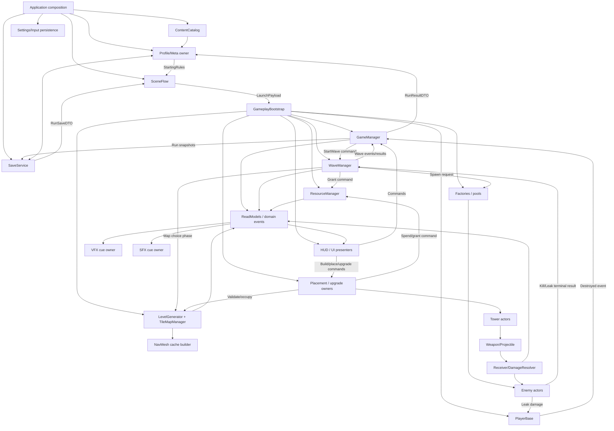
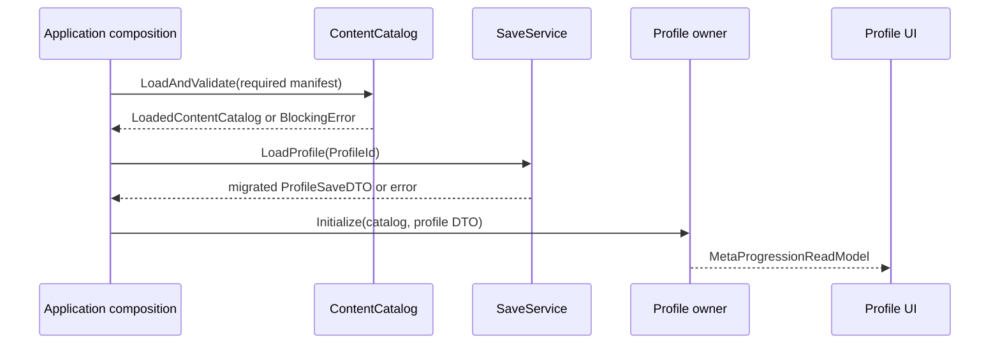
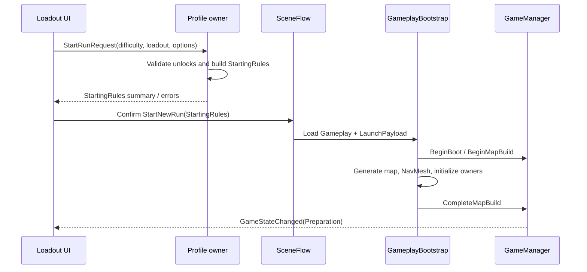
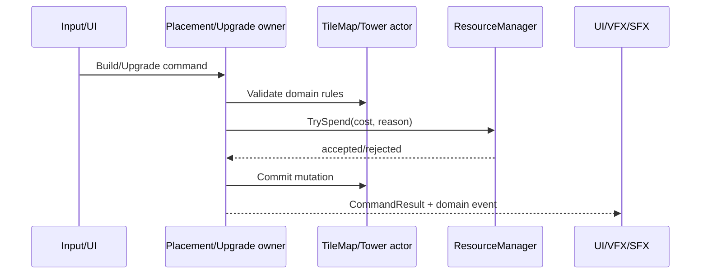
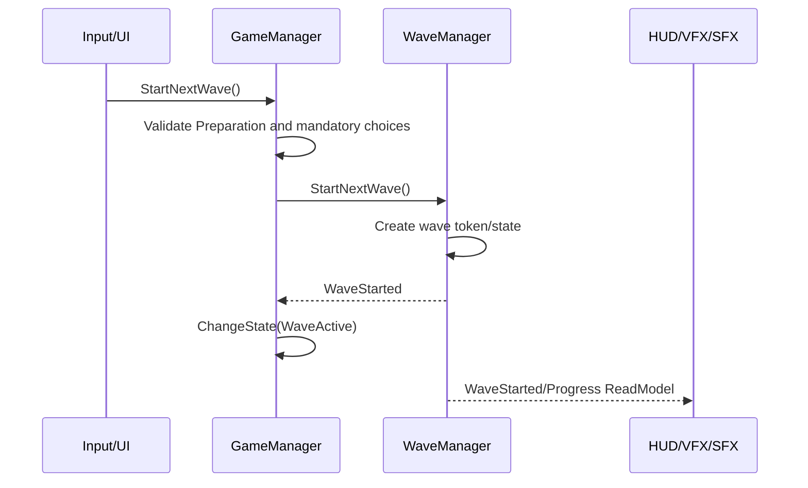
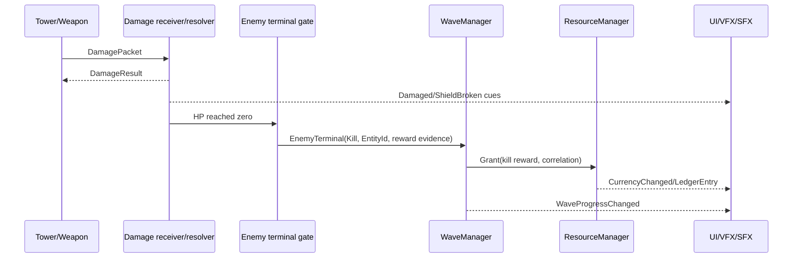
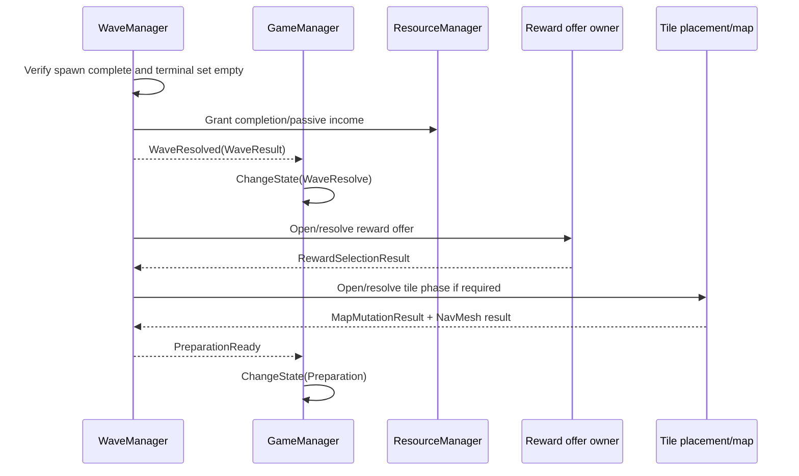
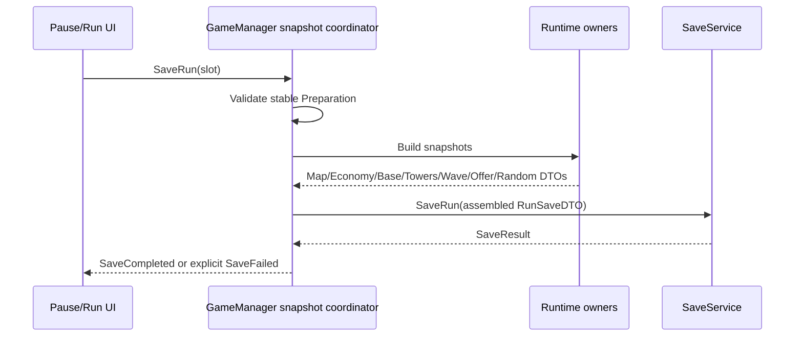
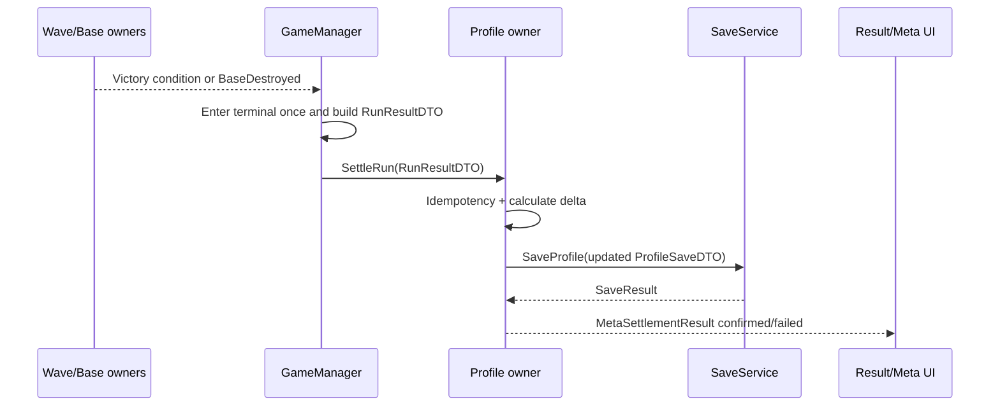

# Gameplay services and interactions

## 1. Назначение и статус

Это master-reference необходимых сервисов, владельцев поведения и их взаимодействий для Prototype Tower Defence 3D.

Документ отвечает на вопросы:

- какие сервисные границы действительно нужны игре;
- какие текущие `MonoBehaviour` уже являются правильными владельцами;
- какие будущие application/profile/save/content services понадобятся для полного run и meta loop;
- кто кому может отправлять command, query, event, snapshot или presentation cue;
- где проходит жизненный цикл application, profile, scene, run, wave, actor и effect;
- что нельзя превращать в новый manager/service;
- как сохранить single entry point и отсутствие параллельного mutable state.

Это архитектурный контракт для будущих задач, а не требование немедленно создать все перечисленные классы и интерфейсы.

Логическое имя сервиса может быть реализовано:

- существующим owner-компонентом;
- методом внутри существующего owner;
- pure C# helper, принадлежащим owner;
- application gateway на реальной I/O-границе;
- отдельным сервисом только при доказанной самостоятельной ответственности и lifecycle.

Текущие код, сцена, prefab, assets и serialized references остаются implementation truth. Если документ расходится с живой цепочкой, будущая задача сначала выполняет read-only owner audit.

## 2. Основные правила

1. Одно mutable значение имеет одного владельца.
2. `GameplayBootstrap` остаётся единственным executable entry point gameplay-сцены.
3. `GameManager` остаётся единственным владельцем глобального `GameState` и переходов run.
4. `WaveManager` остаётся владельцем wave runtime и spawn schedule.
5. `ResourceManager` остаётся владельцем валюты текущего забега.
6. `TileMapManager` остаётся владельцем подтверждённой topology карты.
7. Tower, Enemy, PlayerBase, Projectile и Effect владеют своим instance state; это actor owners, не глобальные сервисы.
8. UI отправляет commands и читает read models; UI не меняет domain state напрямую.
9. VFX/SFX получают immutable result/cue и не возвращают gameplay-решение.
10. SaveService пишет DTO; он не вычисляет reward, damage, цену, unlock или состояние волны.
11. Definition загружаются сверху вниз и не мутируются runtime-сервисами.
12. Required dependency передаётся явно. Runtime scene search не является primary composition path.
13. Нет скрытого fallback: ошибка required content/service/save/map/NavMesh блокирует переход и возвращает явный результат.
14. Никаких параллельных `RunManager`, `RoundManager`, `EconomyManager`, `MetaManager + ProgressionManager`, общего `FeedbackManager` или mutable `GameContext`-мешка.
15. Интерфейс вводится на реальной границе, а не для каждого concrete class.

## 3. Термины

| Термин | Значение |
| --- | --- |
| Owner | Единственное место, которое может менять конкретное mutable state |
| Service | Long-lived или scoped behavior boundary с явными входами, выходами и lifecycle |
| Actor owner | Компонент конкретного world instance: Tower, Enemy, Base, Projectile |
| Coordinator | Оркестрирует несколько owners, но не копирует их state |
| Pure rule/service | C#-логика без Unity lifecycle и собственного gameplay state |
| Gateway | Граница к file/platform/cloud API |
| Catalog | Разрешает stable ContentId в Definition/prefab и валидирует контент |
| Factory/pool | Создаёт или выдаёт технически готовый instance, но не решает gameplay policy |
| Provider | Даёт long-lived consumer-у одну текущую scene dependency без stale reference |
| Registry | Хранит регистрации многих contributors, не становясь владельцем их state |
| Presenter/view controller | Преобразует read model/event в UI, VFX или SFX |
| Command | Намерение изменить state, направленное конкретному owner |
| CommandResult | Синхронный/async результат принятия или отказа команды |
| Event | Immutable факт уже совершившегося изменения |
| ReadModel | Immutable данные для конкретного view/query |
| Snapshot/DTO | Копия owner state для save/transfer, не живой runtime owner |

Статусы в документе:

- **Current** — тип и ответственность уже существуют;
- **Required** — нужен для согласованного полного run/meta contract;
- **Conditional** — выделяется только при указанном пороге сложности;
- **Deferred** — не должен влиять на Basic architecture сейчас.

## 4. Наблюдаемый baseline проекта

| Область | Текущий owner | Статус | Целевая граница |
| --- | --- | --- | --- |
| Scene startup | `GameplayBootstrap` | Current | Один blocking bootstrap result вместо log-and-continue |
| Global run state | `GameManager` | Current | Сохранить owner; добавить terminal RunResult orchestration |
| Wave spawn/runtime | `WaveManager` | Current | Сохранить owner; typed terminal registration и wave token |
| Run currency | `ResourceManager` | Current | Сохранить owner; meta currency вынести в profile owner |
| Initial map | `LevelGenerator`/`MapGenerator` | Current | Генерация вызывается bootstrap-ом |
| Map topology | `TileMapManager`/`TilePlacementValidator` | Current | Единственный map owner + pure validator |
| Tile interaction | `TD.Levels.TilePlacementSystem` | Current | Draft/preview/confirm command owner |
| NavMesh rebuild | `NavMeshSurfaceWrapper` | Current | Derived cache builder после committed map revision |
| Tower purchase/place | `TD.Towers.TowerPlacementSystem` | Current | Атомарная placement transaction |
| Tower combat/upgrade | `Tower`, `TowerStats`, `IWeapon` | Current | Actor-owned; без TowerService |
| Enemy HP/move | `MonsterHealth`, `MonsterMove` | Current | Actor-owned terminal result |
| Base HP | `PlayerBase` | Current | Actor-owned; единственный source of truth HP |
| Projectile pool | `GameObjectPool` | Current | Technical pool с reset/release lifecycle |
| Reward offer | Внутри `WaveManager` | Current/thin | Оставить внутри до появления saved offers/history/reroll complexity |
| UI | `GameHUD`, `WaveUI`, `TowerShopUI` | Current | Commands + read models/events, без UI state ownership |
| Profile/meta | `ResourceManager` + PlayerPrefs placeholder | Temporary | Один future profile/meta owner |
| Run/Profile save | Нет | Required | Versioned DTO + SaveService |
| Content catalog | Direct refs, `Resources`, `TileDatabase` | Partial | Логический catalog owner; отдельный loader только при необходимости |
| Scene flow | `SceneManager` внутри `GameManager` | Partial | Application SceneFlow при появлении menu/profile/continue scenes |
| Typed damage/shield/status/aura | Нет общей границы | Required при механике | Receiver-owned state + pure resolver/rules |
| Deterministic run random | `UnityEngine.Random` локально | Missing | Run-scoped random owner для saveable offers/generation |
| VFX/SFX routing | Prefab/UnityEvent/local callbacks | Partial | Cue owners; отдельные players только при переиспользовании |

Baseline содержит runtime searches, static `Instance` и несколько fallback-путей. Они считаются compatibility debt, а не образцом для новых сервисов. Будущая задача исправляет только затронутую owner chain, без широкого переписывания проекта.

## 5. Scopes и composition roots

| Scope | Создаёт/связывает | Живёт до | Может знать | Не может удерживать |
| --- | --- | --- | --- | --- |
| Application | Application composition | Quit | Content, Save, Profile, Settings, SceneFlow | Мёртвые scene actors/views |
| Profile | Profile/meta owner | Смена профиля | ProfileSave, meta Definitions, receipts | Run currency/map/towers |
| Scene | `GameplayBootstrap`/scene composition | Scene unload | Scene owners, camera, HUD, app service handles | Предыдущую scene |
| Run | Gameplay owners | Terminal/abandon | StartingRules, map, economy, base, towers | Следующий независимый run |
| Phase | `GameManager` | State transition | Разрешённые commands/offer | Несвязанный profile state |
| Wave | `WaveManager` | WaveResolve/stop | Spawn cursor, registered enemies, wave token | ProfileSave |
| Actor | Factory/instantiate/pool | Death/leak/return | Собственные stats/effects/targets | Global transition state |
| Effect | Receiver/emitter | Expire/source removal | Source, stacks, duration | Permanent profile mutation |
| Command | Caller/owner | Return/completion | Immutable payload | Long-lived state |
| Event | Publisher | Dispatch complete | Immutable fact | Mutable owner reference |

Dependency должна жить не меньше consumer. Application-service не хранит scene `MonoBehaviour`; scene service не хранится в ProfileSave; actor не становится владельцем run service.

### 5.1 Single entry points

- **Application entry:** будущий `ApplicationBootstrap` только когда появятся persistent services и более одной пользовательской сцены.
- **Gameplay scene entry:** текущий `GameplayBootstrap`.
- **Start-wave gate:** только `GameManager.StartNextWave()`.
- **Wave execution:** только `WaveManager.StartNextWave()` после команды `GameManager`.
- **Run terminal:** только `GameManager` создаёт terminal outcome/RunResult.
- **Meta settlement:** одна операция profile owner `SettleRun(RunResultDTO)`.
- **Save I/O:** только SaveService/gateway пишет или читает storage.
- **Content resolution:** только catalog owner разрешает stable ContentId на dynamic boundary.

`Awake`, `OnEnable` и `Start` других компонентов могут готовить локальный instance, но не запускают параллельный gameplay flow.

Если в сцене используется объект `SceneComposition`/DI context, он только хранит и связывает dependency graph. Executable запуск всё равно выполняет один `GameplayBootstrap`; второго bootstrap flow нет.

## 6. Общий service graph



Стрелка означает command, result, event, snapshot или immutable data. Она не означает, что каждый узел обязан быть отдельным `GameObject` или interface.

## 7. Типы взаимодействия

### 7.1 Command

Используется для намерения изменить state.

```text
Caller → Owner.Command(payload) → CommandResult
```

Примеры:

- UI → `GameManager.StartNextWave()`;
- TowerShop → placement owner `BeginPlacement(TowerId)`;
- placement owner → `ResourceManager.TrySpend(cost, reason)`;
- WaveManager → `ResourceManager.Grant(reward, reason)`;
- UI → profile owner `TryPurchaseUnlock(UnlockId)`.

Command адресуется одному owner. Event bus не используется как command transport.

### 7.2 Query/ReadModel

```text
View/Presenter → Owner.BuildReadModel() → immutable ReadModel
```

Query не возвращает mutable collection или внутренний state для изменения. Частое polling допустимо для frame-sensitive HUD, но события + bounded refresh предпочтительнее полного обхода сцены.

### 7.3 Domain event

```text
Owner mutates state → publishes immutable event → UI/VFX/SFX/other coordinator reacts
```

Event сообщает о свершившемся факте. Subscriber не должен отменять уже committed mutation или изменять owner state через payload.

### 7.4 Direct result callback

Для короткой orchestration-цепочки direct method/result проще global bus:

```text
TilePlacementSystem.Confirm() → PlacementResult → WaveManager continues phase
```

### 7.5 Snapshot/DTO

```text
Owner.BuildSnapshot() → coordinator → SaveService
SaveService.Load() → migrated DTO → GameplayBootstrap.Restore()
```

DTO не становится live state и не содержит `GameObject`, `Transform`, event, callback или mutable ScriptableObject.

### 7.6 Presentation cue

```text
Domain event/result → CueRequest → VFX/SFX player
```

Cue может содержать position, EntityId, intensity и CueId, но не право менять damage/reward/wave result.

## 8. Application и profile services

### 8.1 Application composition

**Статус:** Conditional сейчас, Required при menu/profile/continue flow.

**Форма:** один application root, созданный в boot scene или штатной startup-точке.

**Создаёт:** ContentCatalog, SaveService, Profile/meta owner, Settings owner, SceneFlow и application audio root, если они действительно persistent.

**Не делает:** не генерирует карту, не запускает wave, не ищет Tower/Enemy и не хранит run state.

**Контракт:**

```text
InitializeApplication()
  → Load/validate required content
  → Load/migrate settings/profile
  → expose explicit application services
ShutdownApplication()
  → flush requested writes
  → release content/audio/platform handles
```

При текущей единственной `Gameplay.unity` отдельный persistent root не нужен только ради «правильной архитектуры». Он вводится вместе с реальной application boundary.

### 8.2 ContentCatalog

**Статус:** Partial logical owner сейчас; Required для stable IDs/save/meta; loader extensions Conditional.

**Scope:** application/content.

**Владеет:** loaded Definition lookup, catalog validation, content version, optional provider handles.

**Читает:** direct references, `Resources`, `TileDatabase`, Wave/Tower/Enemy/Tile assets; позже Addressables/mod manifests.

**Выдаёт:** immutable Definitions/prefab references по `ContentId`.

**Не владеет:** runtime Tower/Enemy, current wave, balance, unlock state или save state.

```text
LoadAndValidate(ContentRequest) -> LoadedContentCatalog | BlockingError
Resolve<TDefinition>(ContentId) -> Definition | NotFound/TypeMismatch
ResolvePrefab(ContentId) -> prefab reference/handle | error
Release(scope)
```

Basic может оставаться набором существующих catalogs и прямых ссылок под одним bootstrap validation pass. Не создавать wrapper asset только ради имени `ContentCatalog`.

Addressables или mod provider не являются fallback друг для друга. Выбранный manifest определяет provider; missing required content блокирует load.

### 8.3 SaveService

**Статус:** Required, ещё не реализован.

**Scope:** application/I/O.

**Владеет:** serialization format, file paths/slots, atomic write, backup policy, schema dispatch, storage errors.

**Не владеет:** ProfileSave mutations, run calculations, reward settlement, gameplay validation или live owners.

```text
LoadProfile(ProfileId) -> ProfileSaveDTO + MigrationReport | SaveError
SaveProfile(ProfileSaveDTO) -> SaveResult
LoadRun(SaveSlotId) -> RunSaveDTO + MigrationReport | SaveError
SaveRun(RunSaveDTO) -> SaveResult
Archive/DeleteRun(SaveSlotId) -> SaveResult
Load/SaveSettings(SettingsSaveDTO) -> SaveResult
```

SaveService получает полностью собранный DTO. Он не обходит сцену и не вызывает `FindObjectsByType`.

### 8.4 Profile/Meta owner

**Статус:** Required для meta loop; текущий PlayerPrefs StartingReserve — временный placeholder.

**Scope:** profile/application.

**Владеет:** единственный mutable `ProfileRuntimeState`, meta currency, unlocks, objective progress, selected loadout/starting options, settlement receipts.

**Зависит от:** ContentCatalog для Definition, SaveService для I/O, meta Definitions/rules.

**Не знает:** Tower/Enemy/Tile scene instances, current run currency, current wave или HUD.

```text
LoadOrCreateProfile(ProfileId) -> ProfileReadModel | error
SettleRun(RunResultDTO) -> MetaSettlementResult
TryPurchaseUnlock(UnlockId) -> CommandResult
SelectStartingOption(OptionId/Slot) -> CommandResult
SelectLoadout(ContentIds[]) -> CommandResult
BuildStartingRules(StartRunRequest) -> StartingRules | ValidationError
BuildMetaReadModel() -> MetaProgressionReadModel
```

`SettleRun` выполняет idempotency check, применяет delta к одной транзакции ProfileSave, сохраняет её и только после успешной записи возвращает подтверждённый результат.

Не создавать одновременно `ProfileService`, `MetaManager`, `UnlockManager`, `MetaCurrencyManager` и `ObjectiveManager` как mutable stores. Pure calculators/rules могут принадлежать одному profile owner.

### 8.5 SceneFlow

**Статус:** Conditional сейчас, Required при появлении menu/profile/result scenes.

**Scope:** application.

**Владеет:** scene load/unload transition, launch payload lifetime, cancellation и blocking transition UI state.

**Не владеет:** GameState, wave state, map, run currency или meta settlement.

```text
StartNewRun(StartingRules) -> SceneTransitionResult
ContinueRun(RunSaveDTO) -> SceneTransitionResult
RestartRun(RestartRequest) -> SceneTransitionResult
ExitRun(destination) -> SceneTransitionResult
```

SceneFlow передаёт в `GameplayBootstrap` immutable `LaunchPayload = StartingRules | RunSaveDTO`. Он не переносит живые scene objects между сценами.

Пока сцена одна, `GameManager.RestartGame()` через `SceneManager` остаётся текущим простым путём. SceneFlow добавляется вместе с реальной второй сценой, а не заранее.

### 8.6 Settings и input override owner

**Статус:** Conditional/application feature.

**Владеет:** пользовательские graphics/audio/gameplay settings и сохранённые Input System binding overrides.

**Не владеет:** текущей доступностью gameplay commands; её определяют GameState/UI mode owners.

Unity Input System остаётся engine input service. Не нужен общий custom `InputManager`, который копирует все actions. Project owner нужен только для load/save overrides, apply/reset и read model настроек.

```text
LoadSettings() -> SettingsSaveDTO
ApplySettings(SettingsCommand) -> CommandResult
SaveBindingOverrides(json) -> SaveResult
ResetBindings() -> CommandResult
```

### 8.7 Localization owner

**Статус:** Unity Localization package уже является основной системой.

Project code хранит stable table/key references в Definitions/read models. Отдельный wrapper service нужен только для dynamic mod tables, language download или общей смены locale с application lifecycle.

UI не строит gameplay rules из локализованного текста. Localization — presentation boundary.

### 8.8 Application audio root

**Статус:** Conditional.

Persistent audio root оправдан, если музыка и mixer state переживают scene transition. Он владеет mixer volumes, music transition и application audio handles.

Он не заменяет scene/actor SFX emitters и не становится общим feedback manager. Gameplay передаёт ему только music/SFX cue requests.

### 8.9 Editor-only content services

**Статус:** Conditional authoring infrastructure, не runtime graph.

К этой границе относятся:

- content validator для stable IDs, обязательных prefab/Definition/localization/cue links;
- editor icon renderer, который создаёт icon из 3D gameplay prefab;
- catalog/Addressables/mod manifest builder;
- asset generation MenuItems и importers;
- test fixtures для Definition/formula validation.

Они работают в Editor assembly/`Assets/Editor`, используют `AssetDatabase`, `PrefabUtility`, Undo и explicit user command. Они могут читать runtime Definitions, но runtime code не зависит от editor service и не содержит `UnityEditor` API.

Generated asset записывается только явной authoring-операцией. Editor validator не чинит отсутствующие runtime links скрыто и не меняет prefab/scene topology при входе в Play Mode.
## 9. Gameplay scene и run services

### 9.1 GameplayBootstrap

**Статус:** Current; целевая роль — executable scene composition root.

**Scope:** scene/run startup.

**Владеет:** только последовательностью проверки, создания/restore и initialization. Не хранит долгоживущий mirror RunState.

**Serialized dependencies Basic:** `LevelGenerator`, `GameManager`, `WaveManager`, `ResourceManager`, `TileMapManager`, tile/tower placement owners, `NavMeshSurfaceWrapper`, `PlayerBase`, HUD/presenters, factories/pools и launch payload provider.

```text
Bootstrap(LaunchPayload, CancellationToken) -> BootstrapResult

1. Validate serialized graph and required content
2. GameManager.BeginBoot/BeginMapBuild
3. Create new owner state or apply migrated RunSaveDTO
4. Generate/restore committed map
5. Build NavMesh derived cache
6. Place/initialize base and spawn anchors
7. Initialize ResourceManager, WaveManager, actors and presenters
8. Verify invariants
9. GameManager.CompleteMapBuild -> Preparation
```

**Failure:** остаётся в Boot/MapBuild, отменяет созданные scoped operations, показывает blocking error. Не продолжает с null dependency, default spawn at origin или silently skipped required phase.

**Не делает:** damage, reward calculation, wave spawn, save file I/O, UI text composition или profile mutation.

### 9.2 GameManager

**Статус:** Current; расширять существующего owner.

**Scope:** scene/run.

**Владеет:** `GameState`, transition guards, pause policy, start-wave gate, terminal outcome, restart/exit commands и создание immutable RunResult на terminal boundary.

**Знает:** прямые ссылки на WaveManager, PlayerBase, TimeControl/pause facade и run result/snapshot builders. Может получать SceneFlow endpoint, когда он появится.

**Не знает:** конкретные Tower/Enemy instances, UI widgets, VFX/SFX players, profile mutable state или save file paths.

```text
BeginBoot()
BeginMapBuild()
CompleteMapBuild()
StartNextWave() -> CommandResult
NotifyWaveStarted(WaveId)
NotifyWaveResolved(WaveResult)
NotifyPreparationReady(PreparationSnapshot)
NotifyBaseDestroyed(BaseResult)
FinishRun(Outcome) -> RunResultDTO
TogglePause() -> CommandResult
```

**События:** `GameStateChanged`, `RunStarted`, `PauseChanged`, `RunFinished`.

`GameManager` создаёт один immutable `RunResult` на terminal transition и публикует его через `onRunFinished`; повторный terminal callback не создаёт второй результат. Текущий Basic runtime заполняет core summary (run id, seed, difficulty, wave/base/economy/combat counters, duration и content version); meta settlement и save DTO остаются отдельными владельцами.

UI и input вызывают `StartNextWave()` только здесь. WaveManager сообщает факты событиями/results, но не меняет GameState напрямую.

Pause остаётся ортогональным progression state: TimeControl меняет время, GameManager меняет разрешённость input/presentation. Не добавлять `PauseManager` или второй `Paused` run flow.

### 9.3 WaveManager

**Статус:** Current; сохраняет ownership.

**Scope:** run/wave.

**Владеет:** ordered wave definitions, current wave index, spawn schedule/cursor, wave cancellation token, registered alive enemy IDs, completion guard и inter-wave phase orchestration.

**Получает:** WaveDefinitions/StartingRules, spawn anchor snapshot, run random, enemy creation endpoint, ResourceManager command endpoint, optional reward/map phase endpoints.

**Не владеет:** GameState, run currency, base HP, map topology, Tower state, ProfileSave или UI panels.

```text
Initialize(WaveDefinitions, SpawnAnchors, RunRules, RunRandom)
BuildWaveIntel(nextIndex) -> WaveIntelReadModel
StartNextWave() -> CommandResult
RegisterSpawnedEnemy(EnemyHandle)
NotifyEnemyTerminal(EnemyTerminalResult)
ResolveWave() -> WaveResult
StopWave(reason) -> StopResult
BuildWaveSnapshot() -> WaveSaveDTO
```

**События:** `WaveStarted`, `EnemySpawned`, `EnemyTerminal`, `WaveProgressChanged`, `WaveResolved`, `PreparationReady`, `AllWavesCompleted`.

Enemy completion хранится как terminal set/IDs, а не только декрементируемый счётчик. Один actor может дать ровно один `Kill` или `Leak`; повторный terminal event отклоняется.

Wave async принадлежит wave/run token. `GameManager` вызывает существующий `WaveManager.ForceStopWave()` перед Defeat и перед restart reload; `GetCancellationTokenOnDestroy()` остаётся teardown safety net, но не единственным механизмом для terminal/Abandon, пока сцена ещё жива.

Current `WaveManager` также содержит thin reward offer и tile phase. Для Basic это допустимо. Выделение отдельного reward owner описано в разделе 14.

Для ML-generated `WaveConfig` этот owner передаёт в `CreateGenerated` применённые adaptive health/count/speed/reward-факторы и сохраняет их вместе с wave provenance; authored waves и ML observation/action contract при этом не изменяются.

### 9.4 ResourceManager

**Статус:** Current; единственный owner run currency.

**Scope:** run.

**Владеет:** current run balance, run income settings/state и при необходимости bounded ledger.

**Не владеет:** meta currency, PlayerPrefs unlock, reward eligibility, Tower cost Definition, wave completion или UI text.

```text
CanAfford(Cost) -> bool
TrySpend(Cost, SpendReason, CorrelationId) -> CommandResult + LedgerEntry
Grant(Amount, GrantReason, CorrelationId) -> CommandResult + LedgerEntry
BuildEconomySnapshot() -> EconomySaveDTO
BuildEconomyReadModel() -> EconomyReadModel
Restore(EconomySaveDTO)
```

Grant/spend атомарны и публикуют balance before/delta/after. Domain owner определяет цену и причину; ResourceManager только валидирует и применяет денежную mutation.

Current `UnlockStartingReserve()` и чтение PlayerPrefs должны исчезнуть при ProfileSave migration. После миграции StartingRules передаёт стартовую валюту в ResourceManager, а gameplay не читает profile storage.

### 9.5 RunRandom

**Статус:** Required для saveable random offers/generation; может быть pure C# object.

**Scope:** один run.

**Владеет:** seed, deterministic PRNG state и при необходимости именованные streams для map/reward/wave.

**Не владеет:** gameplay outcomes или Definitions.

```text
NextInt(streamId, min, max)
NextFloat(streamId)
Shuffle(streamId, values)
CaptureState() -> RandomStateDTO
Restore(RandomStateDTO)
```

UI, VFX и cosmetic-only randomness не должны сдвигать gameplay stream. Save/continue восстанавливает state либо сохраняет уже сгенерированные offers. Нельзя после load reroll-ить choices случайным вызовом.

Не создавать global `RandomService.Instance`; object создаётся GameplayBootstrap-ом из StartingRules/RunSave.

### 9.6 Run snapshot orchestration

**Статус:** Required вместе с RunSave, но не обязательно отдельный class.

Это command-scoped coordinator внутри `GameManager` или `GameplayBootstrap`, пока нет причины выделять самостоятельный тип.

```text
RequestSave(slot)
  → verify GameState/SavePolicy
  → ask each owner for immutable snapshot
  → assemble RunSaveDTO
  → SaveService.SaveRun(dto)
  → publish SaveCompleted/SaveFailed
```

Он не хранит вторую живую копию RunState. Owners не знают file paths и не вызывают SaveService сами.

Recommended Basic boundary — stable Preparation между волнами. Mid-wave snapshot остаётся Deferred до появления полного enemy/projectile/effect restore contract.

### 9.7 RunResult builder

**Статус:** Required вместе с meta settlement; может быть pure helper, принадлежащий GameManager.

```text
BuildRunResult(
  GameManager terminal state,
  Wave snapshot,
  Economy summary,
  Base summary,
  Tower/build summary,
  Run modifiers,
  objective evidence) -> immutable RunResultDTO
```

Builder читает snapshots и не меняет owners. RunResult создаётся один раз на terminal transition и имеет stable RunId/ResultVersion.

## 10. Карта, placement и navigation

### 10.1 LevelGenerator/MapGenerator

**Статус:** Current.

**Scope:** map-build command внутри run startup.

**Владеет:** процессом генерации initial layout и промежуточными данными команды. После commit source of truth переходит в TileMapManager.

**Не владеет:** текущей wave, spawn schedule, Tower occupancy или NavMesh как save state.

```text
GenerateInitialMap(LevelGenerationDefinition, RunRandom) -> GeneratedMapResult
RestoreMap(MapSaveDTO) -> GeneratedMapResult
```

Generation failure блокирует bootstrap. Не подменять invalid generated map заранее подготовленной картой без явной выбранной Definition.

### 10.2 TileMapManager

**Статус:** Current; единственный owner committed map topology.

**Scope:** scene/run.

**Владеет:** tile instances/IDs, grid positions/rotations, road connections, occupancy, map revision, base/spawn topology snapshot.

**Использует:** pure `TilePlacementValidator`.

**Не владеет:** ghost preview, UI selection, NavMesh data, WaveManager spawn cursor или reward offer.

```text
CanPlace(TilePlacementDraft) -> PlacementValidationResult
CommitTile(TilePlacementCommand) -> MapMutationResult
RegisterTowerOccupancy(position, TowerId) -> CommandResult
UnregisterTowerOccupancy(position, TowerId)
BuildMapSnapshot() -> MapSaveDTO
BuildSpawnAnchorSnapshot() -> SpawnAnchors
ValidateTopology(rootPosition) -> bool + reason
GetMapRevision() -> revision
```

`TileMapManager.ValidateTopology` delegates to the pure `TilePlacementValidator`. It rejects connection mismatches and tile components disconnected from the committed root before the level can advance to NavMesh or wave preparation. Open road ends remain valid spawn topology and are exposed through the spawn-anchor snapshot.

`RoadTileDef`/Definition не мутируется instance position/rotation в целевой модели; instance placement хранится отдельно в runtime state.

### 10.3 TilePlacementValidator

**Статус:** Current pure helper.

**Scope:** command/query.

**Вход:** current topology snapshot + tile Definition + position/rotation/rules.

**Выход:** `PlacementValidationResult` с reason code и affected topology preview.

Не создаёт prefab, не списывает валюту, не меняет TileMapManager и не показывает UI.

### 10.4 TilePlacementSystem

**Статус:** Current scene interaction owner.

**Scope:** Preparation/draft.

**Владеет:** current tile draft, selected offer index, ghost/preview instance и input mode.

**Не владеет:** committed map, reward history, GameState или NavMesh.

```text
BeginOffer(PlacementChoices) -> CommandResult
SelectPrevious/Next() -> PlacementReadModel
RotateDraft() -> PlacementReadModel
ConfirmDraft() -> MapMutationResult
CancelDraft() -> CommandResult
```

При confirm система просит TileMapManager повторно валидировать и commit-ить. После успешного commit публикуется `TilePlaced(MapRevision)`; только затем перестраивается NavMesh и обновляются spawn anchors.

Cancel не означает успешное завершение mandatory tile phase, если правила run требуют выбора. Optional/mandatory определяется Wave/Run rules, а не отсутствием ссылки.

### 10.5 NavMeshSurfaceWrapper

**Статус:** Current Unity adapter/derived cache builder.

**Scope:** scene/map revision.

```text
Rebuild(mapRevision, CancellationToken) -> NavMeshBuildResult
```

NavMesh не является source of truth и не сохраняется в RunSave. Result должен соответствовать текущей map revision. Пока build не успешен, WaveManager не получает новые spawn/path anchors и Preparation не становится stable.

### 10.6 Spawn anchors

Spawn points — derived snapshot карты, не отдельный mutable manager.

TileMapManager строит `SpawnAnchors` после committed topology. GameplayBootstrap/WaveManager получают snapshot/scene handles, валидные для текущей revision.

Если нужен dynamic world representation, один scene owner создаёт/обновляет `SpawnPoint` objects. WaveManager не создаёт default spawn at origin и не ищет tag как fallback.

## 11. Tower build и actor owners

### 11.1 TowerShopUI

**Статус:** Current presenter/input source, не service owner.

Получает `TowerShopReadModel`; отправляет `BeginTowerPlacement(TowerId)`. Не читает prefab stats для расчёта финальной цены как самостоятельный источник истины и не списывает валюту.

Preview/icon создаются из content/presentation data, а не становятся Tower Definition.

### 11.2 TowerPlacementSystem

**Статус:** Current scene interaction owner.

**Scope:** Preparation/draft transaction.

**Владеет:** выбранный TowerId/prefab, ghost, hit/overlap validation и placement input mode.

**Зависит от:** TileMapManager surface/occupancy query, ResourceManager, Tower factory/instantiate endpoint, content Definition.

```text
BeginPlacement(TowerId) -> PlacementReadModel | rejection
UpdateDraft(pointer/world position) -> PlacementReadModel
ConfirmPlacement() -> TowerPlacementResult
CancelPlacement() -> CommandResult
```

`ConfirmPlacement` является атомарной domain transaction:

1. повторно проверить GameState = Preparation;
2. разрешить Tower Definition/prefab;
3. проверить surface/occupancy;
4. проверить цену;
5. создать и полностью initialize Tower;
6. зарегистрировать occupancy;
7. применить spend;
8. commit-ить result и event.

Если шаг до commit не выполнен, деньги и occupancy не меняются. Если техническая ошибка возможна после reserve/spend, transaction имеет явный rollback, а не бесплатную башню или потерю денег.

Runtime topology ghost не меняется из `Awake/Start`; prefab composition authorится заранее.

### 11.3 Tower

**Статус:** Current actor owner; отдельный `TowerService` не нужен.

**Владеет:** tower EntityId, Definition/Stats reference, grade/branch, modifiers, target policy/current target, cooldown, weapon, local aura/status and presentation hooks.

**Получает:** actor initialization data, target candidates через текущую physics query или future registry, upgrade commands, damage delivery endpoint.

**Не владеет:** run currency, map topology, global list of enemies или wave state.

```text
Initialize(TowerSpawnData)
TryUpgrade(UpgradeCommand) -> TowerUpgradeResult
SetTargetPolicy(policy) -> CommandResult
TickTargeting/Attack()
BuildTowerSnapshot() -> TowerSaveDTO
BuildTowerReadModel() -> TowerPanelReadModel
```

Стоимость upgrade определяется Definition/runtime modifiers, но spend выполняется через ResourceManager как часть Tower-owned upgrade transaction. UI вызывает Tower/upgrade owner, а не ResourceManager напрямую.

### 11.4 Sell/relocate/respec

**Статус:** Conditional mechanic.

Команда принадлежит Tower/build owner, который рассчитывает refund/rules, меняет occupancy и вызывает ResourceManager. `ResourceManager` не решает sell value. Destroy/disable выполняется только после committed result.

Relocate использует placement draft и сохраняет исходную occupancy до успешного нового commit.

## 12. Enemy, combat и effect owners

### 12.1 Enemy creation endpoint

**Статус:** Conditional extraction; сейчас WaveManager вызывает `Instantiate`.

Отдельный `EnemyFactory` нужен при pooling, Addressables, injected initialization, stable EntityId или нескольких spawn consumers.

```text
CreateEnemy(EnemySpawnRequest) -> EnemyHandle | SpawnError
ReturnEnemy(EnemyHandle, TerminalReason)
```

Factory создаёт технически валидного actor и вызывает initialization. WaveManager решает когда/сколько/где spawn; factory не выдаёт reward и не считает wave complete.

Basic может оставить создание private-методом WaveManager, если тот выполняет тот же contract.

### 12.2 MonsterHealth/MonsterMove

**Статус:** Current actor owners.

`MonsterHealth` владеет HP/receiver terminal state. `MonsterMove` владеет path movement и достижением базы. Они могут быть двумя компонентами одного Enemy aggregate, но не двумя глобальными сервисами.

```text
Initialize(EnemySpawnData, BaseTarget, EntityId)
ReceiveDamage(DamagePacket) -> DamageResult
ReachBase() -> EnemyTerminalResult.Leak
Die() -> EnemyTerminalResult.Kill
```

Runtime Basic path is `MonsterMove.Initialize(PlayerBase)`. `GameplayBootstrap` passes its serialized `PlayerBase` to `WaveManager.Initialize`, and `WaveManager` passes the same target to every spawned actor before health/speed registration. `MonsterMove` does not search the scene or retain a static base reference; a missing target blocks wave start or spawn initialization explicitly.

Base target передаётся при spawn; static cached scene reference и scene search не являются целевым dependency path. При stall, когда агент сообщает non-finite `remainingDistance`, `MonsterMove` отбрасывает устаревший corridor и синхронно перестраивает путь к базе; ограниченное steering recovery используется только для конечной длины пути.

Kill и Leak проходят через одну idempotent terminal gate. Leak может нанести Base damage, но не выдаёт kill reward. После terminal result actor отписывается, очищает effects/targetability и возвращается в pool/destroy.

### 12.3 DamageResolver

**Статус:** Required при введении damage types/shields/armor; pure domain operation, не singleton manager.

В простой текущей модели `MonsterHealth.TakeDamage(float)` остаётся достаточным owner path. Когда появляются typed damage, щиты и status application, общий алгоритм должен быть одинаковым для Enemy/Base/других receivers.

```text
Resolve(DamagePacket, ReceiverSnapshot, DamageRules) -> DamageResult
```

Рекомендуемый порядок:

1. validate source/target/alive/flags;
2. применить immunity/resistance/vulnerability;
3. absorb/block shield;
4. применить armor/penetration;
5. применить HP damage;
6. определить crit/overkill/stagger, если они уже зафиксированы packet/rules;
7. сформировать effect applications;
8. вернуть immutable DamageResult;
9. receiver commit-ит собственный state один раз;
10. публикуются domain/presentation events.

Resolver не ищет targets, не списывает валюту, не создаёт VFX и не меняет WaveManager.

### 12.4 Damage receiver

Receiver component на Enemy/Base владеет shield, armor/resistance snapshot, HP и active effects. Он вызывает pure resolver, commit-ит DamageResult и публикует `Damaged`, `ShieldBroken`, `Died/Destroyed`.

Не нужен глобальный `HealthManager` или `ShieldManager`.

### 12.5 Status effects

**Статус:** Required при механике; actor-owned collection + pure stack/tick rules.

```text
ApplyEffect(StatusApplication) -> EffectApplyResult
TickEffects(delta/timeStep)
RemoveEffect(instanceId/reason)
BuildEffectSnapshot() -> EffectSaveDTO[]
```

Active effects принадлежат receiver. Definition immutable. Общий helper рассчитывает stack/refresh/replace. Отдельный scene `StatusManager` не нужен, пока profiling/determinism не требует централизованного scheduler.

Between-wave save обычно очищает combat-only effects; mid-wave save сохраняет их только в Deferred contract.

### 12.6 Auras

**Статус:** Required mechanics boundary, но не обязательно service class.

Basic: `AuraEmitter` actor-owned, обнаруживает receivers, применяет source-tagged modifiers и снимает их при exit/disable/destroy.

```text
Emitter active
  → receiver enters
  → ApplyModifier(SourceEntityId, AuraId)
  → refresh while eligible
  → RemoveAllFromSource on exit/source death
```

Scene `AuraRegistry` вводится только если много emitters/receivers требуют единого spatial query, deterministic ordering или profiling показал проблему. Registry хранит registrations, но modifiers/effect state остаются у receiver.

Не нужен `AuraManager` для каждой ауры или глобальный mutable list без lifecycle.

### 12.7 Targeting и spatial registry

Current Tower владеет target selection и использует physics query. Это KISS Basic.

Общий EnemyRegistry/spatial index — Conditional optimization, когда:

- множество Tower повторяет дорогие overlap queries;
- ауры и AoE используют тот же candidate set;
- нужен deterministic target ordering;
- profiling подтверждает bottleneck.

Registry регистрирует active targetables и выдаёт query snapshots. Tower всё равно выбирает target policy и хранит current target.

### 12.8 Projectile/weapon

Weapon доставляет `DamagePacket`; Projectile владеет полётом, collision, lifetime и single-impact gate. Ни Weapon, ни Projectile не решают reward/death/wave completion.

Pool reset очищает target, packet, trail, timers, subscriptions и effects. Return выполняется ровно один раз.

### 12.9 GameObjectPool/factories

**Статус:** Current technical service.

Pool scope — scene/run или application только если asset handles переживают scenes. Он владеет inactive/rented instances и prefab mapping, но не actor domain state.

```text
Rent(prefab/ContentId) -> instance
Return(instance) -> ResetResult
ReleasePool() -> release all instances/handles
```

Pool не подменяет missing prefab другим prefab и не создаёт unpooled instance как скрытый fallback, если выбранный pooling contract required.
## 13. Economy interactions

ResourceManager — единственный monetary mutation owner текущего run, но экономическое решение принадлежит вызывающему domain owner.

| Операция | Кто определяет amount/rules | Кто меняет balance | Кто показывает feedback |
| --- | --- | --- | --- |
| Kill reward | Enemy/Wave reward Definition и terminal result | ResourceManager | HUD/SFX/VFX по ledger event |
| Wave completion | WaveManager/WaveDefinition | ResourceManager | Wave result UI |
| Passive income | EconomyDefinition/run economy rule | ResourceManager | HUD/result breakdown |
| Tower purchase | Tower Definition + placement owner | ResourceManager внутри transaction | Shop/placement UI |
| Tower upgrade | Tower/Upgrade Definition | ResourceManager внутри Tower transaction | Tower panel/VFX/SFX |
| Sell refund | Tower/build rule | ResourceManager | Tower panel/world feedback |
| Repair | Repair domain owner/Base rule | ResourceManager + PlayerBase transaction | Base HUD/VFX/SFX |
| Reward currency grant | Reward application owner | ResourceManager | Reward UI/HUD |
| Meta purchase | Profile/meta Definition | Profile owner, не ResourceManager | Meta UI |

CorrelationId/Reason предотвращают неясный повтор grant/spend в save/retry-sensitive paths. Ledger может быть bounded и diagnostic; balance остаётся source of truth.

Не создавать `EconomyManager` поверх ResourceManager. Pure pricing/income formulas принадлежат ему или вызывающему domain owner.

## 14. Reward services

### 14.1 Basic reward flow

**Статус:** текущий thin owner внутри WaveManager.

WaveManager может хранить `RewardOfferRuntimeState` и ждать выбора, если:

- один offer между волнами;
- небольшой фиксированный набор choices;
- нет reroll/banish/history/deck;
- save сохраняет exact offer через WaveManager snapshot;
- reward application маршрутизируется реальному domain owner.

```text
WaveResolved
  → WaveManager opens RewardOfferState
  → UI reads RewardOfferReadModel
  → UI SelectReward(OfferId, ChoiceId)
  → WaveManager validates pending offer
  → reward effect routed to ResourceManager/PlayerBase/Tower/RunModifier owner
  → offer marked consumed once
  → RewardSelected event
```

UI не применяет reward. ResourceManager не выбирает eligibility.

### 14.2 RewardRoller

**Статус:** Required при randomized content; pure C# helper.

```text
Roll(RewardPoolDefinition, EligibilitySnapshot, RunRandom) -> RewardOffer
```

Roller не хранит pending offer и не применяет reward. Он фильтрует prerequisites/exclusions и использует run random.

### 14.3 Когда выделять RewardOfferOwner

Отдельный run-scoped owner оправдан, когда одновременно появляются несколько из условий:

- saved pending offers;
- reroll/banish/cost;
- reward history и duplicate protection;
- несколько источников offer;
- deck/pool mutations;
- UI открывает offer вне WaveManager phase;
- несколько reward application types и tests WaveManager становятся неуправляемыми.

Тогда WaveManager только запускает/ожидает phase и получает `RewardSelectionResult`. Новый owner не копирует wave state и run currency.

Не создавать `RewardManager`, `OfferManager`, `CardManager` и `ModifierManager` одновременно без отдельных реальных lifecycles.

### 14.4 Run modifiers и challenge rules

Run modifier не требует общего mutable `ModifierManager`.

- wave-only challenge state принадлежит WaveManager;
- economy modifier применяется к правилам/состоянию ResourceManager;
- Tower modifier хранится в Tower/TowerStats;
- map modifier применяется LevelGenerator/TileMap rules;
- starting modifier фиксируется в StartingRules и передаётся нужному owner при bootstrap.

Если один modifier затрагивает несколько domains, reward/profile owner создаёт immutable `RunModifierInstance`, а coordinator применяет отдельные owner-side deltas атомарно. Общий список может быть snapshot/read side для RunSave/RunResult, но не второй источник фактических stats/currency/wave rules.

Pure challenge/modifier evaluators допустимы для общей формулы. Difficulty и challenge остаются Definition + selected IDs + owner-side effects; отдельные `DifficultyManager` и `ChallengeManager` не нужны.

## 15. Presentation services

### 15.1 UI presenters

**Статус:** Current views; target contract Required.

`GameHUD`, `WaveUI`, `TowerShopUI`, tower/enemy panels и result/meta screens являются views/presenters.

Они:

- получают прямые owner references от scene composition;
- подписываются на domain events;
- запрашивают bounded read models;
- отправляют typed commands;
- управляют только visual/navigation/focus/localization state;
- симметрично отписываются.

Они не:

- хранят истинный balance/HP/wave index/unlock;
- вычисляют authoritative price/reward/damage;
- выдают currency;
- загружают ProfileSave;
- ищут обязательные owners каждый frame.

Отдельный `UIDataService` не нужен. Pure ReadModel builder допустим, если один и тот же сложный projection используют несколько views.

### 15.2 Input routing

Input System actions принадлежат input asset/player input. Domain availability принадлежит GameManager и interaction mode owners.

```text
InputAction performed
  → UI/Input adapter checks current mode
  → typed command to owner
  → CommandResult
  → UI feedback
```

- Start Wave → GameManager;
- build/placement → placement owner;
- select/inspect → SelectionSystem;
- pause → GameManager;
- rebind → settings/input override owner.

Не нужен central `InputService`, копирующий каждое action. Input adapter не меняет gameplay state сам.

### 15.3 VFX cue owner

**Статус:** Presentation responsibility Required; отдельный service Conditional.

Basic prefab-local UnityEvents/VFX components допустимы, если lifecycle очевиден. Общий `VfxCuePlayer` нужен при shared pools, data-driven CueId, world-space routing и reusable impacts.

```text
Play(VfxCueRequest) -> VfxHandle | optional failure
Stop(handle/source)
ReleaseScope(scene/run)
```

VFX получает DamageResult/PlacementResult/RewardResult, а не raw mutable actor. VFX failure не меняет gameplay result. Missing required cue не подменяется случайным effect; cue может быть явно optional/N/A в Definition.

### 15.4 SFX cue owner

**Статус:** Presentation responsibility Required; отдельный service Conditional.

```text
Play(SfxCueRequest)
Stop(loopHandle)
SetBusVolume(bus, value)
```

One-shot world SFX может играть actor component; shared pooling/mixer routing — scene/application player. SFX не определяет hit timing, reward или state transition.

### 15.5 Music owner

MusicService/Audio root выбирает track по high-level state/event и выполняет transition. GameManager публикует state; он не управляет AudioSource напрямую.

Music state не входит в RunSave, кроме явно нужной cosmetic resume position.

### 15.6 Camera и selection

CameraRig/RTSCameraController владеет camera movement. SelectionSystem владеет selected EntityId/reference в scene scope.

TowerShop/placement могут посылать camera disable token или interaction mode через прямой узкий contract. Они не ищут camera каждый enable и не добавляют ещё один CameraManager.

Selection публикует `SelectionChanged`; inspect UI строит read model из выбранного actor. Selection не владеет Tower stats/Enemy HP.

## 16. Кто о ком должен знать

| Consumer/owner | Может знать напрямую | Причина | Не должен знать |
| --- | --- | --- | --- |
| Application composition | Content, Save, Profile, SceneFlow, Settings | Создаёт application graph | Scene Tower/Enemy/HUD |
| ContentCatalog | Content providers/manifests | Resolve/validate | Profile mutable state, run state |
| SaveService | Serializer/file/platform gateway | I/O | Scene components, reward rules |
| Profile owner | ContentCatalog, SaveService, meta rules | Unlock/settlement/StartingRules | Current Tower/Map/Wave |
| SceneFlow | Scene loader, immutable launch payload | Transition | Live RunState internals |
| GameplayBootstrap | App endpoints + all required scene owners | Scene composition | Future scene objects after unload |
| GameManager | WaveManager, PlayerBase, TimeControl, terminal builders | Global transitions | UI widgets, individual enemies |
| WaveManager | Definitions, spawn endpoint, ResourceManager, phase endpoints | Wave orchestration | GameState mutation, ProfileSave |
| ResourceManager | Economy rules/current balance | Run currency | Tower list, UI, ProfileSave |
| LevelGenerator | Generation Definitions, RunRandom, TileDatabase/catalog | Initial map | Wave state/currency |
| TileMapManager | Validator, tile instances/occupancy | Map source of truth | Reward/UI/NavMesh source state |
| TilePlacementSystem | TileMapManager, input adapter, preview | Draft/commit | Wave mutable internals |
| NavMesh adapter | Committed map/world geometry | Derived cache | Save ownership, rewards |
| TowerPlacementSystem | Tower definitions/factory, map, ResourceManager | Placement transaction | Wave schedule/profile |
| Tower | Own stats/weapon, target query | Actor behavior | Run balance owner internals |
| Enemy | Own stats/receiver/move, Base target | Actor behavior | UI/ProfileSave |
| DamageResolver | Packet/rules/receiver snapshot | Pure calculation | Unity scene, VFX/SFX |
| Status/Aura emitter | Receiver endpoint/registry if present | Apply/remove modifiers | Currency/wave transition |
| Pool/factory | Prefab/catalog, initialization contract | Instance lifecycle | Reward/wave policy |
| UI presenter | Owner command/query endpoints | Interaction/presentation | Mutable owner fields for writing |
| VFX/SFX player | Cue definitions/assets/pools | Presentation | Gameplay decisions |
| Run snapshot coordinator | Owner snapshot endpoints, SaveService | Atomic DTO collection | Direct private state mutation |

### 16.1 Допустимая двусторонняя связь

`GameManager → WaveManager` command и `WaveManager → GameManager` event не являются двумя owners, если:

- GameManager единственный меняет GameState;
- WaveManager единственный меняет wave state;
- command и event typed;
- нет рекурсивного hidden transition;
- подписки и lifecycle явны.

То же относится к placement owner ↔ ResourceManager: domain owner командует spend, ResourceManager возвращает result; они не копируют balance/cost state друг друга.

### 16.2 Запрещённые циклы

- UI меняет ResourceManager, затем вручную сообщает Tower, что upgrade успешен;
- WaveManager меняет GameState и GameManager меняет wave index;
- Profile owner читает scene singletons для settlement;
- SaveService вызывает gameplay methods при deserialization;
- VFX callback наносит authoritative damage;
- Map owner запускает следующую wave;
- actor вызывает SceneManager или ProfileSave.

## 17. Interaction sequences

### 17.1 Application/profile boot



Если content/profile load неуспешен, Start Run недоступен. Новый пустой профиль создаётся только по явному create-profile contract, не как fallback для повреждённого save.

### 17.2 Новый забег



StartingRules immutable. Gameplay не перечитывает mutable ProfileSave после начала run.

### 17.3 Continue run

```text
Continue command
  → SaveService.LoadRun(slot)
  → migrate/validate ContentVersion and IDs
  → SceneFlow loads Gameplay with RunSaveDTO
  → GameplayBootstrap restores owners in deterministic order
  → derived stats/NavMesh/read models rebuild
  → GameManager enters saved stable Preparation
```

Restore не вызывает payout, reroll, objective settlement или StartWave. DTO применяются owners, а не сохраняются как mutable source of truth.

### 17.4 Gameplay bootstrap

```text
Validate graph
  → create RunRandom
  → initialize ResourceManager
  → generate/restore TileMap
  → place/initialize PlayerBase
  → build NavMesh
  → build spawn anchors
  → initialize WaveManager
  → restore/create Towers
  → initialize HUD/presenters
  → verify invariants
  → enter Preparation
```

Порядок Tower restore после map/base нужен для valid placement and target dependencies. UI активируется после готовности owners.

### 17.5 Preparation command flow



Для transactions, где создание может упасть, порядок reserve/create/commit проектируется так, чтобы отказ не оставил partial mutation.

### 17.6 Start wave



Никакой другой button/input path не вызывает WaveManager напрямую.

### 17.7 Spawn и actor initialization

```text
WaveManager reads SpawnGroupDefinition
  → asks RunRandom for lane/variation
  → EnemyFactory/private spawn endpoint creates actor
  → actor.Initialize(EntityId, stats snapshot, Base target, modifiers)
  → WaveManager registers EntityId alive
  → EnemySpawned event
```

`enemiesAlive++` происходит только после успешной initialization/registration. Spawn failure возвращает explicit error и следует WaveRules policy; он не считается убитым enemy и не подменяется другим prefab.

### 17.8 Hit, Kill и reward



Kill reward применяется один раз после принятого terminal result. VFX/SFX не инициируют reward.

### 17.9 Leak и Base damage

```text
Enemy reaches Base
  → Enemy terminal gate claims Leak
  → Base.ReceiveDamage(leak DamagePacket/amount)
  → DamageResult/BaseHealthChanged
  → WaveManager.NotifyEnemyTerminal(Leak)
  → no kill reward
  → if Base destroyed: PlayerBase event → GameManager Defeat
```

Defeat отменяет wave token и блокирует completion payout/inter-wave phase.

### 17.10 WaveResolve и inter-wave phase



Completion payout фиксируется до save boundary и имеет correlation/guard. PreparationReady публикуется только после всех mandatory phases и valid NavMesh.

### 17.11 Save между волнами



UI не показывает success до SaveResult. Save failure не переключается на PlayerPrefs или другой slot без команды пользователя.

### 17.12 Terminal и meta settlement



Если profile write неуспешен, run result сохраняется/помечается pending согласно явному contract; UI не объявляет unlock полученным. `ResourceManager.UnlockStartingReserve()` больше не участвует после migration.

### 17.13 Scene unload

```text
Block new commands
  → cancel phase/wave/run tasks
  → finish requested save/transition transaction
  → unsubscribe UI/presentation
  → unregister actors/contributors
  → return/release pools
  → release scene Addressable handles
  → clear scene providers/static compatibility refs
  → unload scene
```

Application/profile services продолжают жить, но не удерживают scene references.
## 18. Lifecycle и initialization contracts

### 18.1 Application

```text
Create once
  → initialize content/storage/platform
  → load/switch profile
  → load/unload scenes
  → quit cancellation
  → flush requested writes
  → release handles
```

Persistent services защищены от дублей, имеют explicit shutdown и не зависят от Unity Domain Reload для reset.

### 18.2 Scene/run

```text
Scene authored topology
  → Awake: local invariants only
  → GameplayBootstrap validates/injects/initializes
  → run active
  → terminal/abandon
  → stop/cancel/unregister
  → scene unload
```

Required component topology создаётся в scene/prefab authoring, не добавляется `Awake/Start` как lazy repair.

### 18.3 Wave

```text
Create WaveRuntimeState/token
  → spawn/register actors
  → combat
  → accept exactly one terminal result per actor
  → resolve once
  → payout once
  → cancel/release token/state
```

Wave state не переиспользуется следующей wave без explicit reset.

### 18.4 Actor/pool

```text
Instantiate/Rent
  → reset all reused fields
  → Initialize required dependencies/data
  → register targetable/alive/effects
  → active behavior
  → terminal/disable
  → unregister/unsubscribe/cancel tasks
  → return/destroy
```

Pooled `OnDisable` не равен permanent destroy, но обязан снять active registrations. `OnEnable` может повторяться.

### 18.5 Effect/aura

```text
Apply with SourceEntityId
  → stack/refresh/replace
  → tick/affect
  → expire/source exit/source destroyed/receiver terminal
  → remove modifiers and presentation handles
```

Remove симметричен Apply. Source destruction снимает все source-tagged effects.

### 18.6 UI/presentation

```text
Bind owner/read model
  → subscribe
  → render
  → send commands
  → unbind/unsubscribe
```

View не должна пережить owner scope. Async animation/localization request имеет view cancellation token.

## 19. Registration и provider patterns

### 19.1 Direct reference — default

Если scene содержит один GameManager/WaveManager/ResourceManager/TileMapManager, `GameplayBootstrap` хранит serialized reference и передаёт её consumers. Это Basic KISS path.

### 19.2 Dynamic contributors

Если множество dynamic actors должны быть видимы service-у:

```text
Factory initializes actor
  → actor/owner Register(handle)
  → service uses handle/snapshot
  → terminal/disable Unregister(handle)
```

Registry не создаёт actor и не владеет его HP/stats.

### 19.3 Singleton-like scene view для application service

Если long-lived application service должен обратиться к одной текущей scene view, используется narrow provider:

```text
Scene view Awake/Initialize -> provider.SetCurrent(view)
Scene unload/OnDestroy -> provider.Clear(view)
Application consumer -> provider.TryGetCurrent()
```

Предпочтительнее передавать immutable request через SceneFlow, чтобы application service вообще не знал view.

### 19.4 Static Instance compatibility

Текущие `GameManager.Instance`, `WaveManager.Instance`, `ResourceManager.Instance`, `TileDatabase.Instance` существуют. Новая цепочка не должна автоматически добавлять ещё один singleton.

При затрагивании owner:

- bootstrap/direct reference становится primary path;
- static может остаться compatibility API до отдельной migration;
- duplicate instance не создаётся;
- `OnDestroy` очищает static только если это текущий owner;
- static cached scene actor сбрасывается при scene/run lifecycle.

## 20. Failure, cancellation и transaction policy

| Ситуация | Владелец решения | Требуемое поведение |
| --- | --- | --- |
| Missing required Definition/prefab | ContentCatalog/bootstrap | Blocking error; run не стартует |
| Invalid StartingRules | Profile owner/bootstrap | Validation result; сцена не входит в run |
| Corrupt/incompatible save | Save/migration boundary | Explicit error/recovery choice; не new-run fallback |
| Map generation invalid | LevelGenerator/bootstrap | Boot/MapBuild failure |
| NavMesh rebuild failed | NavMesh adapter/bootstrap/map phase | Не входить в stable Preparation/WaveActive |
| Spawn failed | WaveManager/spawn endpoint | Explicit WaveError policy; не подмена prefab |
| Insufficient currency | ResourceManager/domain transaction | Rejected CommandResult; state не меняется |
| Placement invalid | Placement/Map owner | Rejected result + reason/read model |
| Upgrade technical failure | Tower transaction | Нет spend/partial grade |
| Duplicate Kill/Leak | Enemy terminal gate/WaveManager | Ignore/reject duplicate with diagnostic, no reward |
| Duplicate completion payout | WaveManager | Guard by wave instance/correlation |
| Save write failed | SaveService/caller coordinator | UI получает failure; snapshot не объявляется сохранённым |
| Meta settlement repeated | Profile owner | Idempotent receipt, no duplicate reward |
| Profile write failed | Profile owner/SaveService | Settlement not confirmed; no alternate storage fallback |
| Optional VFX/SFX missing | Presentation owner | No gameplay effect; explicit optional/N/A diagnostic |
| Scene unload during async | Scope owner | Cancel token, cleanup registrations/handles |

### 20.1 Cancellation scopes

- application token — quit;
- scene token — scene unload;
- run token — terminal/abandon;
- wave token — WaveResolve/force stop/terminal;
- actor token — destroy/return;
- view token — disable/destroy;
- command token — caller cancellation/timeout where meaningful.

Новая async-логика использует UniTask и token реального owner. Fire-and-forget допустим только если owner наблюдает exception и cancellation.

### 20.2 No fallback

Не допускаются скрытые замены:

- Addressables → Resources;
- missing spawn points → origin;
- invalid save → silently new game;
- missing service → `FindAnyObjectByType` и продолжение;
- pool failure → direct Instantiate;
- missing localized/content ID → случайный asset;
- profile write failure → PlayerPrefs;
- required tile phase failure → автоматический skip.

Optional feature может отсутствовать только потому, что `RunRules`/Definition явно помечает её optional. Это не fallback.

## 21. KISS и SOLID в этом graph

### KISS

- Сначала расширить реального owner.
- Pure helper предпочтительнее нового long-lived manager, если нет lifecycle/state.
- Direct serialized/constructor dependency предпочтительнее locator/bus.
- Один command method предпочтительнее цепочки forwarding wrappers.
- Один Profile owner предпочтительнее набора meta managers.
- Actor-owned state остаётся на actor.

### SRP

- GameManager — transitions, не wave spawn.
- WaveManager — wave orchestration, не currency storage.
- ResourceManager — balance mutation, не pricing/reward policy.
- TileMapManager — committed map, не preview/UI/NavMesh truth.
- SaveService — I/O, не state mutation rules.
- Profile owner — progression, не scene gameplay.
- VFX/SFX — presentation, не domain result.

### OCP

Добавление Tower/Enemy/Reward/DamageType идёт через Definition/strategy/catalog, не через новый manager на каждый тип.

### LSP

Интерфейс вводится только если implementations действительно взаимозаменяемы и соблюдают один contract: content provider, save gateway, weapon, damage rule, factory.

### ISP

UI получает узкие command/query endpoints. Application service не получает полный GameManager, если ему нужен только RunResult callback.

### DIP

High-level owner зависит от нужного contract/endpoint, а Unity API/file/platform detail остаётся в adapter/gateway. В Basic direct concrete reference допустима, когда нет второй реализации и тестовая граница не нужна.

## 22. Не создавать без доказанной причины

- `RunManager` или `RoundManager` поверх GameManager/WaveManager;
- `EconomyManager` поверх ResourceManager;
- `TowerManager`, `EnemyManager`, `HealthManager`, `ShieldManager`, `StatusManager` для actor-owned state;
- `MapService` поверх TileMapManager;
- `RewardManager + OfferManager + ModifierManager` одновременно;
- `MetaManager + ProfileService + ProgressionManager + UnlockManager` как несколько mutable owners;
- общий `FeedbackManager` для UI/VFX/SFX;
- global event bus для локальных direct events;
- global ServiceLocator;
- mutable ScriptableObject runtime service;
- `GameContext`/`RunContext` как мешок всех owners и state;
- repository вокруг обычного in-memory list;
- interface для класса без boundary/consumer;
- provider, если direct scene reference имеет тот же lifecycle;
- ECS/jobs/spatial service без profiling.

## 23. Current → target migration map

| Current факт | Целевой шаг при связанной задаче | Не делать |
| --- | --- | --- |
| `GameplayBootstrap` логирует null и продолжает | Вернуть blocking BootstrapResult и не менять state дальше | Создавать missing owners runtime |
| GameManager/WaveManager используют static Instance | Передать direct refs из bootstrap в затронутой цепочке | Массово переписывать все singletons рядом |
| `WaveManager` ищет map/placement и skip-ает phase | Serialize/inject endpoints; explicit optionality/error | Добавлять второй inter-wave manager без сложности |
| WaveManager считает alive int по `onDeath` | Stable EntityId + terminal set Kill/Leak | EnemyRegistry как второй owner HP |
| Spawn fallback ищет tag/создаёт origin | Передать validated SpawnAnchors | Оставлять silent fallback |
| ResourceManager читает/пишет StartingReserve PlayerPrefs | Однократно мигрировать в ProfileSave/StartingRules | Держать оба storage paths |
| GameManager напрямую вызывает SceneManager | Оставить до второй сцены; затем SceneFlow boundary | Вводить SceneFlow заранее без consumer |
| UI polls Instance/Find | Direct refs + events/read models при затронутом UI | Central UIDataService |
| Tower/placement напрямую используют ResourceManager.Instance | Owner transaction с direct economy endpoint | UI direct spend |
| MonsterMove ищет/caches PlayerBase | Передать Base target при spawn/init | Новый BaseManager |
| Projectile наносит raw float damage | При damage types перейти на DamagePacket/receiver resolver | Global DamageManager singleton |
| Reward offer hardcoded в WaveManager | Definitions + RunRandom; split owner только по threshold | Card framework для трёх choices |
| Map Definition хранит instance position/rotation | Runtime TileInstanceState отдельно | Копировать map state в UI/NavMesh |
| Save/Profile отсутствуют | Versioned DTO + SaveService + one Profile owner | PlayerPrefs для полного save |
| VFX/SFX локальны | Добавить CueDefinition/requests; player только при sharing | FeedbackManager |

## 24. Required, Conditional и Deferred service set

### 24.1 Basic/current gameplay

Нужны и уже в основном существуют:

- GameplayBootstrap;
- GameManager;
- WaveManager;
- ResourceManager;
- LevelGenerator/MapGenerator;
- TileMapManager + TilePlacementValidator;
- tile/tower placement owners;
- NavMesh adapter;
- PlayerBase, Tower, Enemy, Weapon, Projectile actor owners;
- technical pool/factory behavior;
- HUD/UI presenters;
- Input System и Localization engine services.

Для стабилизации полного Basic run добавить как behavior boundaries, не обязательно отдельные classes:

- blocking bootstrap validation;
- RunRandom;
- typed EnemyTerminalResult;
- run snapshot orchestration + SaveService;
- RunResult builder;
- minimal logical ContentCatalog/stable IDs.

### 24.2 Basic meta

Добавляются:

- application composition root, когда появляется boot/menu boundary;
- one Profile/meta owner;
- SaveService ProfileSave operations;
- ContentCatalog resolution по stable IDs;
- SceneFlow;
- StartingRules builder;
- idempotent settlement.

### 24.3 Mechanics-triggered Required

При реализации соответствующей механики:

- damage types/shields/armor → DamagePacket/Result + pure resolver + receiver state;
- statuses → actor effect collection + stack rules;
- auras → emitter/receiver lifecycle, registry только при необходимости;
- randomized rewards/map → RunRandom + exact saved offer;
- Addressables/mods → content provider/handle owner;
- settings/rebinding persistence → settings/input override owner;
- shared SFX/VFX pools → cue players.

### 24.4 Extended

- extracted RewardOfferOwner;
- typed Enemy/Tower factories;
- EnemyRegistry/spatial index;
- run history/statistics read side;
- multiple local profiles/slots;
- objectives service logic внутри Profile owner через pure evaluators;
- analytics/telemetry sink;
- multiple content packs/Addressables;
- application music transitions.

### 24.5 Deferred

- cloud save/conflict gateway;
- online account/profile;
- seasons/dailies/live config;
- remote content delivery;
- generic event bus;
- ECS/Jobs actor simulation;
- replay/network determinism;
- multiple currencies/managers;
- editor/runtime service framework migration без конкретной задачи.

Deferred services не добавляются в Basic composition graph заранее.

## 25. Future task template

Каждая service-задача должна записать:

```text
1. Gameplay behavior/feature:
2. Current live owner chain:
3. Mutable state and single owner:
4. Service/actor/pure rule/gateway classification:
5. Scope and lifecycle:
6. Existing type to extend:
7. Why a new type is necessary, if any:
8. Required dependencies and how they are passed:
9. Commands and CommandResults:
10. Queries/ReadModels:
11. Domain events:
12. Save/Profile/Content boundary:
13. Async owner and cancellation token:
14. Registration/unregistration:
15. Failure/no-fallback behavior:
16. Transaction/atomicity/idempotency:
17. UI/Input interaction:
18. VFX/SFX interaction:
19. Explicitly prohibited duplicate owners:
20. Verification scenario:
```

Если owner неизвестен, задача сначала выполняет read-only owner audit. Если новый service только пересылает вызов существующему owner, он не создаётся.

## 26. Definition of done для service-задачи

Service-задача завершена только если:

1. найден текущий callback/entry point и реальный owner chain;
2. mutable state имеет одного владельца;
3. service classification и lifecycle соответствуют зависимости;
4. single entry point не обойдён;
5. command направлен owner-у, event публикуется после commit;
6. UI/VFX/SFX не стали источником gameplay state;
7. save/content/profile boundaries используют DTO/stable IDs без Unity object references;
8. async имеет owner token и явную ошибку;
9. subscriptions/registrations/load handles имеют симметричный cleanup;
10. transaction не оставляет partial currency/map/actor/profile mutation;
11. duplicate Kill/Leak/payout/settlement защищены;
12. required failure не запускает fallback;
13. новый manager/interface/provider/event bus обоснован реальным consumer/lifecycle;
14. существующие dirty/untracked изменения сохранены;
15. text encoding/EOL и diff scope проверены;
16. C# при наличии проверен Unity compile/Console;
17. runtime behavior при наличии доказан bounded Play Mode smoke, а не только static review.
