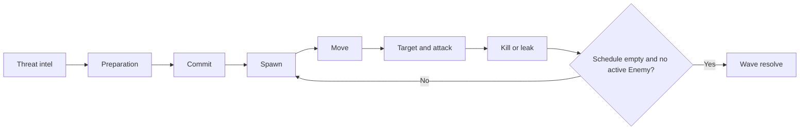
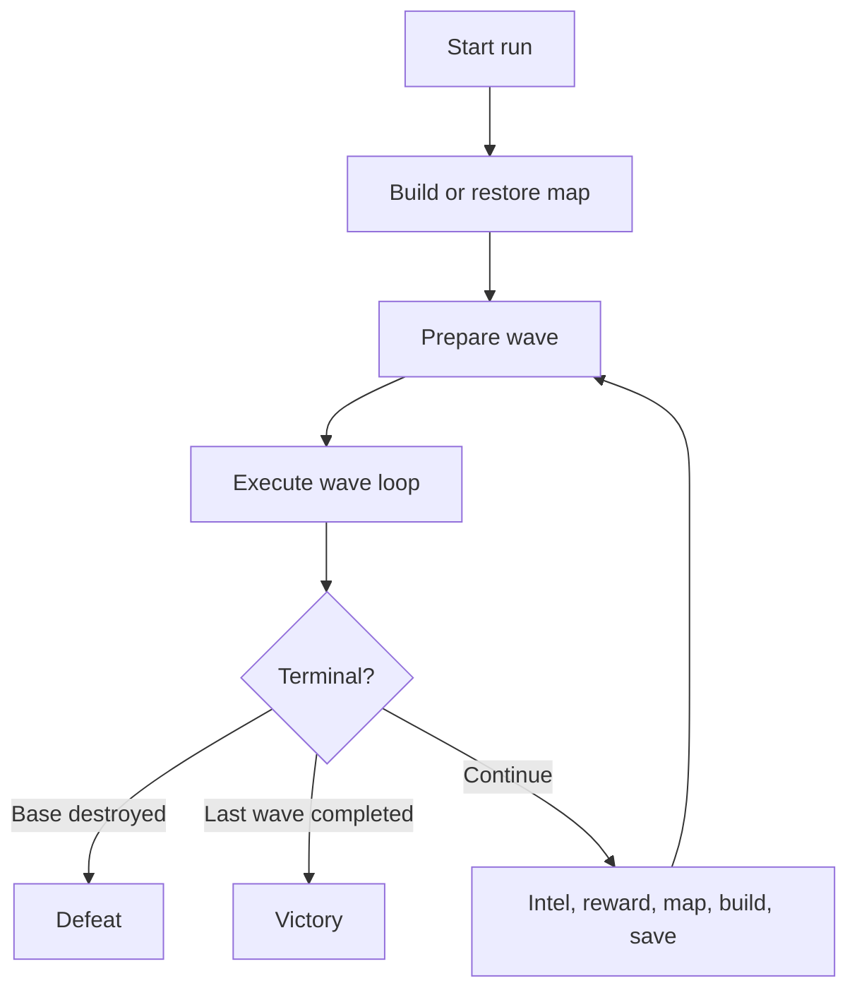
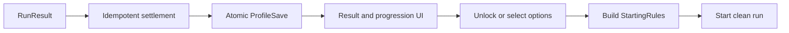

# Gameplay loops и экономики

## 1. Назначение

Документ проектирует tower-defense roguelite с нуля. Он не предполагает существующих классов, scenes, prefabs или save-систем.

Три вложенных цикла:

```text
Wave loop: секунды/минуты
  вложен в Run loop: десятки минут
    вложен в Meta loop: много забегов
```

У каждого цикла отдельны:

- входные данные;
- решения игрока;
- mutable state;
- экономика;
- результат;
- граница сохранения;
- критерий завершения.

## 2. Игровая фантазия

Игрок строит оборону и формирует поле боя, получает заранее читаемую угрозу, наблюдает автоматический бой и использует результат для следующего решения.

Главная причинная цепочка:

```text
информация → подготовка → commit → симуляция → наблюдаемый результат → следующее решение
```

Глубина создаётся сочетанием:

- topology карты и времени врага под огнём;
- ограниченного бюджета;
- разных ролей Tower и Enemy;
- Ground/Flying фильтров;
- damage, shield, armor, status и aura matchups;
- накопительных последствий внутри run;
- горизонтальных unlock между runs.

## 3. Core loop одной волны

### 3.1 Граница

Начало — открыта подготовка к конкретной wave и игрок видит threat intel, карту, оборону и бюджет.

Конец — spawn schedule исчерпан, каждый Enemy завершён как `Kill` или `Leak`, base жива либо получен `Defeat`, а economy result применён ровно один раз.

Не входят:

- полный выбор start rules run;
- выбор следующей wave;
- результат всего run;
- meta reward и unlock.

### 3.2 Одна строка

> Увидеть угрозу → выбрать контрмеру → потратить ограниченный ресурс → запустить wave → прочитать результат автоматического боя → получить доход и/или повреждение base.

### 3.3 Фазы



Логические состояния верхнего уровня:

```text
Preparation → WaveActive → WaveResolve
```

Intel, map choice, build и commit — подэтапы `Preparation`, а не отдельные глобальные managers.

## 4. Threat intel

До необратимых расходов игрок видит:

- Enemy types/roles и count;
- Ground/Flying composition;
- spawn groups, lanes и directions;
- speed, approximate HP, shield/armor/resistances;
- leak damage;
- support/aura/status traits;
- special wave rule;
- completion reward preview.

Скрытая информация допустима только как явно заявленный modifier. Missing Definition не считается fog of war.

### Действие → эффект → feedback

| Действие | Gameplay mutation | Польза | Feedback |
| --- | --- | --- | --- |
| Открыть intel | Нет | Снижает неопределённость | Cards, traits, lanes, icons |
| Выбрать Enemy group | Нет | Показывает counter | HP/shield/armor/domain tooltip |
| Подсветить lane | Нет | Связывает intel с картой | Spawn и route highlight |

## 5. Preparation

### 5.1 Map decision

Если rules разрешают изменение карты, игрок:

1. выбирает Tile Definition;
2. меняет orientation;
3. видит ghost и route/coverage preview;
4. получает validation result;
5. подтверждает placement.

Owner-side validation проверяет:

- bounds и occupancy;
- socket/edge compatibility;
- обязательные Ground routes;
- authored Flying approach, если wave требует;
- base/spawn connectivity;
- build sockets/footprints;
- цену;
- отсутствие конфликта с существующей обороной.

Preview не меняет map, money, NavMesh, save или random state. Commit изменяет map один раз и инвалидирует derived navigation caches.

### 5.2 Build decision

Игрок может:

- построить новую Tower;
- купить grade/branch upgrade;
- сменить target policy;
- выполнить manual repair, если механика включена;
- продать/переместить Tower, если это разрешено;
- сохранить reserve.

Минимальные варианты Tower roles:

- direct single-target;
- area/swarm;
- slow/support;
- anti-shield или anti-armor;
- anti-air;
- road-contact trap/Tower;
- aura support как Extended.

### 5.3 Road-contact Tower

Road-contact Tower ставится на road interaction surface, но не блокирует route и не создаёт NavMesh obstacle.

При контакте:

- Enemy может погибнуть;
- Tower может получить damage или стать Broken;
- могут получить damage оба;
- выживший Enemy продолжает движение.

Optional auto-repair:

- полное/частичное восстановление между waves;
- восстановление после delay внутри wave;
- regeneration rate;
- optional rebuild from Broken.

Monster break не является sell и не выдаёт refund.

### 5.4 Commit

Игрок нажимает одну команду `StartWave`.

Перед переходом проверяются:

- state = Preparation;
- обязательный offer/map choice завершён;
- карта и navigation готовы;
- wave definition разрешена;
- spawn anchors валидны для Ground/Flying composition;
- нет уже активной wave;
- required content загружен.

После commit Basic-вариант блокирует build/upgrade/map mutations до WaveResolve. Camera, inspect, pause и target policy могут остаться доступны.

## 6. WaveActive

### 6.1 Spawn

Wave schedule создаёт Enemy с:

- stable runtime identity;
- Definition и scaled stats;
- MovementDomain;
- spawn/lane/path context;
- reward/leak contract;
- terminal endpoint.

Enemy считается active только после успешной initialization и регистрации. Spawn error не превращается в автоматический kill и не подменяет prefab.

### 6.2 Ground и Flying movement

- Ground следует Ground route/NavMesh.
- Flying следует direct/aerial waypoint route без Ground NavMeshAgent.
- Оба используют одну wave registration и один Kill/Leak contract.
- Missing aerial route блокирует Flying spawn.

### 6.3 Targeting и attack

Tower:

1. получает candidates;
2. фильтрует alive, range, Ground/Flying, faction/tags и line of sight;
3. применяет target policy;
4. проверяет cooldown;
5. создаёт attack/damage payload;
6. weapon доставляет его;
7. receiver рассчитывает shield/armor/HP result.

UI/VFX/SFX не рассчитывают authoritative damage.

### 6.4 Kill

```text
Enemy HP reaches zero
→ terminal gate claims Kill
→ movement/effects stop
→ wave active set unregisters Enemy
→ kill reward applies once
→ UI/VFX/SFX show confirmed result
→ actor returns to pool/destroy
```

### 6.5 Leak

```text
Enemy reaches Base approach
→ terminal gate claims Leak
→ Base receives leak damage
→ no kill reward
→ wave active set unregisters Enemy
→ actor returns to pool/destroy
```

Если Base HP достигает нуля, run получает один `Defeat`; wave completion payout блокируется.

### 6.6 Наблюдение игрока

Игрок должен понять:

- где coverage недостаточна;
- где projectile не успевает;
- какой target filter исключает Flying/Ground;
- где shield/armor контрит damage;
- где overkill или неправильная policy;
- какая aura/status synergy работает;
- почему Tower Broken и когда восстановится;
- сколько денег принёс каждый source.

## 7. WaveResolve

Успешное completion condition:

```text
spawn schedule exhausted
AND active Enemy set empty
AND Base alive
AND resolve guard not claimed
```

Порядок:

1. зафиксировать последний Enemy terminal result;
2. применить completion/passive income один раз;
3. применить between-wave auto-repair по authored policy;
4. построить WaveResult;
5. показать summary;
6. передать control run loop.

WaveResult содержит kills, leaks, Base delta, Tower broken/restored, kill income, production, completion/passive income и closing balance.

## 8. Экономика одной волны

### 8.1 Sources

- preparation grant/reward;
- kill reward;
- bounty/early-kill modifier;
- production ticks;
- completion reward;
- passive income.

### 8.2 Sinks

- Tile placement;
- Tower build;
- upgrade/branch;
- manual repair;
- active ability/emergency action как Extended;
- sell/relocate transaction costs.

### 8.3 Формула

```text
Bcommit = Bopen + Rpreparation
        - Ctile - Σ Ctower - Σ Cupgrade - Σ Crepair

Bcombat = Bcommit + Σ Rkill + Rproduction

Bclose = Bcombat + Rcompletion + Rpassive
```

Все mutations проходят через один run-currency owner и ledger reason. Balance не может стать отрицательным.

### 8.4 Игровой смысл

- Kill income награждает эффективную оборону.
- Completion income даёт предсказуемую основу.
- Production создаёт риск только если источник можно потерять/отключить.
- Mid-wave spending меняет commit contract и поэтому является Extended.
- Repair должен быть видимым выбором либо authored бесплатной mechanic, но не скрытым catch-up.

## 9. Loop одного забега без меты

### 9.1 Граница

Run начинается с immutable StartingRules и заканчивается `Victory`, `Defeat` или `Abandon`.

Сохраняются внутри run:

- seed/random state;
- map layout;
- Base HP/shield;
- Tower instances, grades, branches, policies, durability;
- run currency;
- run rewards/modifiers;
- next wave index;
- pending exact offer;
- difficulty/challenge selection.

Не переносятся в новый run: map, Towers, run currency, temporary rewards и active enemies.

### 9.2 Схема



### 9.3 Start run

StartingRules определяет:

- seed;
- run rules/difficulty/challenges;
- allowed content/loadout;
- initial map rule;
- starting currency/Base;
- ordered/generated wave contract;
- save policy.

Bootstrap либо полностью создаёт playable run, либо возвращает blocking error. Частично созданный run не входит в Preparation.

### 9.4 Inter-wave sequence

1. Зафиксировать результат предыдущей wave.
2. Проверить Defeat/Victory.
3. Показать next-wave intel.
4. Предложить limited reward, если предусмотрено.
5. Разрешить map expansion, если предусмотрено.
6. Разрешить build/upgrade/repair/reserve decisions.
7. Применить between-wave auto-repair ровно один раз.
8. Построить stable Preparation snapshot.
9. Разрешить save и следующий StartWave.

### 9.5 Run progression

Early run обучает direct/swarm/Ground/Flying basics. Mid run комбинирует shield/armor/support/lanes. Late run проверяет сформированный build, а не вводит неизвестный mandatory counter в финале.

Rewards могут быть:

- horizontal: новая Tower role, target policy, tile option;
- vertical: stat/aura/base repair;
- economic: cache, bounty, passive/production modifier;
- temporary wave modifier;
- run-only augment.

## 10. Экономика одного забега

```text
Bopen(w + 1) = Bclose(w)
```

Основные trade-offs:

- новая Tower против upgrade;
- breadth против specialization;
- current safety против reserve;
- repair против дополнительного damage/control;
- map topology против immediate power;
- production против защищённости источника;
- anti-air investment против Ground pressure.

### 10.1 Snowball

Хорошая игра может давать больше kills, сохранённый Base HP и больший reserve. Это допустимый положительный feedback.

Ограничения:

- kill reward не масштабирует себя бесконечно;
- completion income сохраняет минимальную предсказуемость;
- threat progression проверяет разные свойства build;
- одна универсальная Tower не решает все matchups;
- repair не скрывает все ошибки бесплатно;
- catch-up существует только как явная mechanic.

### 10.2 Death spiral

Run не должен становиться математически проигранным сразу после одной небольшой ошибки. Но потеря Base HP, Tower durability и reserve должна иметь цену.

Средства смягчения:

- completion floor;
- доступный, но не бесплатный repair;
- horizontal counters разных цен;
- visible reward choice;
- ограниченная страховка Base.

Они не включаются динамически тайно.

## 11. Save внутри run

Recommended Basic boundary — stable Preparation между waves.

Сохраняются:

- StartingRules identity и content version;
- seed/random state;
- next wave index;
- map layout/occupancy;
- run balance/modifiers;
- Base HP/shield;
- Towers: type, placement, grade/branch/policy, HP/Broken, persistent repair mode;
- reward history/pending exact offer;
- required preparation flags.

Не сохраняются:

- NavMesh/path caches;
- current targets;
- VFX/SFX/UI selection;
- active projectiles/enemies;
- derived stats.

Mid-wave save требует полный snapshot spawn cursor, Enemy movement/HP/effects, Tower cooldowns/repair timers, auras и projectiles. Частичный restore не допускается.

## 12. Terminal outcomes run

### Victory

- последняя configured wave resolved;
- Base жива;
- completion payout применён;
- new inter-wave flow не запускается;
- создаётся immutable RunResult.

### Defeat

- Base destroyed once;
- wave/run async отменяются;
- completion reward не выдаётся;
- создаётся immutable RunResult.

### Abandon

- явное подтверждение;
- текущая незавершённая wave не даёт reward;
- run закрывается и создаёт outcome по policy.

## 13. Meta loop

### 13.1 Граница

Meta loop начинается с immutable RunResult и заканчивается immutable StartingRules нового run.

Входит:

- settlement;
- meta currency;
- unlocks;
- objectives/milestones;
- difficulty/challenges;
- loadout/starting options;
- ProfileSave.

Не входит:

- current run map/Towers/currency;
- temporary rewards;
- live Enemy state;
- real-money/live-service economy.

### 13.2 Схема



### 13.3 Meta reward

Reward может зависеть от:

- waves completed;
- Victory/Defeat/Abandon;
- difficulty/challenges;
- first clear;
- objectives;
- ограниченных performance milestones.

Intentional quick loss не должен иметь лучший reward-per-time, чем осмысленный progress.

### 13.4 Unlock types

- Tower/content unlock;
- reward/augment pool unlock;
- starting option/loadout slot;
- difficulty/challenge;
- codex/knowledge;
- cosmetic;
- capped vertical upgrade как Extended.

Приоритет — horizontal variety. Новый профиль должен иметь полный playable base set и возможность победить без grind.

## 14. Мета-экономика

Одна Basic meta currency.

```text
MafterSettlement = Mbefore + Mreward
MafterPurchase = MbeforePurchase - UnlockCost
```

Settlement одного RunId применяется не более одного раза. Purchase проверяет prerequisites, ownership и balance, затем записывает currency + unlock одной транзакцией.

### Sources

- progress reward;
- Victory bonus;
- difficulty/challenge bonus;
- first objective/clear.

### Sinks

- horizontal unlock;
- starting option;
- challenge/difficulty access при design необходимости;
- cosmetics;
- capped vertical nodes как Extended.

После полного unlock currency имеет честный sink либо progression считается complete; бесконечное число без назначения не нужно.

## 15. Действие → эффект на трёх уровнях

| Действие | Wave effect | Run effect | Meta effect |
| --- | --- | --- | --- |
| Построить Tower | Добавляет coverage | Формирует build, уменьшает reserve | Нет |
| Upgrade | Меняет matchup | Фиксирует specialization | Нет |
| Tile placement | Меняет route/exposure | Влияет на будущие waves | Нет |
| Target policy | Меняет распределение shots | Даёт накопительный результат | Нет |
| Repair Tower/Base | Возвращает durability | Тратит reserve/сохраняет run | Нет |
| Выбрать run reward | Может усилить current prep | Формирует run identity | Нет |
| Завершить run | Нет | Создаёт RunResult | Settlement |
| Купить unlock | Нет | Не меняет active run | Меняет future content/StartingRules |

## 16. Basic, Extended, Deferred

### Basic

- finite waves;
- one run currency;
- one meta currency;
- Ground + простой Flying;
- Tower placement/upgrades в Preparation;
- automatic combat;
- kill/leak/completion income;
- between-wave save;
- horizontal meta unlocks;
- road-contact Tower и auto-repair только если включены конкретной Definition.

### Extended

- several lanes;
- branches/statuses/auras;
- production/bounty;
- sell/relocate/respec;
- active abilities;
- objectives/challenges;
- capped vertical meta progression;
- mid-wave save.

### Deferred

- endless;
- deckbuilder scale;
- hero control;
- cloud conflicts;
- seasons/live economy;
- network/replay.

## 17. Инварианты loops

- Одна active wave.
- StartWave имеет один command entry point.
- Enemy завершает lifecycle как `Kill XOR Leak`.
- Flying и Ground используют одну wave/economy terminal chain.
- Wave completion/payout idempotent.
- Currency mutation атомарна и не отрицательна.
- Preview не мутирует authoritative state.
- Road-contact Tower не блокирует route.
- Between-wave auto-repair применяется один раз на resolved wave.
- Defeat/Victory terminal и не запускают следующую preparation.
- Run-only data не попадает в ProfileSave.
- RunResult settlement idempotent.
- Новый run получает только StartingRules, а не живой Profile state.
- Required error не включает fallback.

## 18. Acceptance сценарии

### Wave

1. Показать Ground/Flying threat intel.
2. Сделать два осмысленных preparation choices.
3. Commit стартует одну wave.
4. Наблюдать attack, shield/armor/status result.
5. Проверить один Kill reward и один Leak без reward.
6. Проверить road-contact outcome и optional repair.
7. Получить один resolve/payout.

### Run

1. Пройти несколько waves.
2. Перенести map, Towers, durability, Base HP и balance.
3. Выбрать reward/map/upgrade против reserve.
4. Save/continue возвращает тот же offer и state.
5. Отдельно получить Victory и Defeat.

### Meta

1. Settle Defeat и Victory RunResults.
2. Повтор settlement не меняет balance.
3. Купить horizontal unlock атомарно.
4. Создать StartingRules только из unlocked selections.
5. Новый run чист от старых run-only данных.

