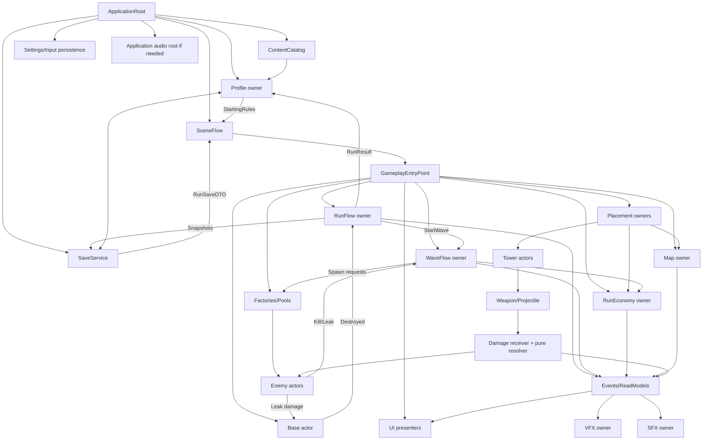

# Services, owners, interactions и lifecycles

## 1. Назначение

Документ определяет с нуля необходимые behavior boundaries и передачу данных. Логическое имя не означает обязательный отдельный class/GameObject/interface.

Граница может быть реализована:

- root MonoBehaviour;
- actor component;
- pure C# object/function;
- application gateway;
- отдельным service только при собственном state/lifecycle.

## 2. KISS service rules

1. Одно mutable значение имеет одного owner.
2. Один executable entry point на application и один на gameplay scene.
3. UI отправляет Commands и читает ReadModels.
4. VFX/SFX получают Results/Cues.
5. SaveService пишет DTO, но не рассчитывает gameplay.
6. Definition идут сверху вниз и не мутируются.
7. Required dependency передаётся явно.
8. Interface нужен на реальной boundary или для нескольких implementations.
9. Pure helper предпочтительнее long-lived manager без state/lifecycle.
10. Missing required dependency/content блокирует operation; fallback нет.

## 3. Scopes

| Scope | Создаёт | Завершает | State |
| --- | --- | --- | --- |
| Application | ApplicationRoot | quit | content/save/profile/settings/scene flow |
| Profile | Profile owner | profile switch | meta currency/unlocks |
| Scene | SceneFlow/Unity | unload | views, camera, scene composition |
| Run | GameplayEntryPoint | terminal/abandon | map/economy/Base/Towers |
| Phase | RunFlow owner | transition | allowed commands/mandatory choices |
| Wave | WaveFlow owner | resolve/stop | spawn cursor/active set/token |
| Actor | factory/pool | terminal/return | HP/movement/target/effects |
| Effect/Aura | receiver/emitter | expiry/exit | instances/membership |
| Command | caller/owner | result | immutable payload |
| Event | publisher | dispatch end | immutable fact |
| View | scene/UI composition | unbind/destroy | presentation only |

Dependency живёт столько же или дольше consumer.

## 4. Single entry points

### 4.1 ApplicationRoot

Единственная process entry для persistent services:

```text
StartApplication
→ load/validate content
→ load/migrate settings/profile
→ open menu or launch flow
```

Если игра стартует сразу с одной gameplay scene и persistent services ещё нет, отдельный ApplicationRoot не создаётся заранее.

### 4.2 GameplayEntryPoint

Единственный executable entry gameplay scene:

```text
StartNewRun(StartingRules)
ContinueRun(RunSaveDTO)
```

Он валидирует graph, создаёт/restores owners, строит map/navigation, инициализирует actors/views и только затем входит в Preparation.

### 4.3 Domain entry gates

- `StartWave` — один RunFlow command gate.
- Wave execution — один WaveFlow owner.
- Run terminal/RunResult — один RunFlow terminal gate.
- Profile settlement — один `SettleRun` operation.
- Save I/O — один SaveService/gateway.
- Content resolution — один ContentCatalog boundary.

`Awake`, `Start`, button callback и VFX callback не создают параллельные flows.

## 5. Общий graph



Стрелка — Command, Result, Event, Snapshot или immutable data. Узел не обязан быть отдельным manager.

## 6. Interaction types

### Command

```text
Caller → Owner.Command(payload) → CommandResult
```

Намерение изменить state. Owner повторно валидирует.

### Query/ReadModel

```text
View → Owner/Builder.BuildReadModel() → immutable projection
```

Не возвращает mutable internal collection.

### Domain Event

```text
Owner commits state → publishes immutable fact → consumers react
```

Event bus не используется как command transport.

### Snapshot/DTO

```text
Owners build snapshots → coordinator assembles DTO → SaveService writes
```

Load DTO применяется owners, не становится live state.

### Presentation Cue

```text
Domain result/event → CueRequest → VFX/SFX player
```

Cue не возвращает gameplay outcome.

## 7. Application services

### 7.1 ContentCatalog

Scope: application/content.

Responsibilities:

- load selected base/Addressable/mod manifests;
- validate IDs/types/dependencies/prefabs/localization/cues;
- resolve Definition/prefab by ContentId;
- own/release load handles;
- expose immutable catalog/version.

Does not own runtime actors, unlocks, waves or balance.

Providers (direct/Resources/Addressables/mod) are explicit selections, not fallback chain.

### 7.2 SaveService

Scope: application/I/O.

Responsibilities:

- serialize/deserialize envelope;
- file paths/slots;
- atomic write;
- integrity/schema dispatch;
- storage errors;
- archive/delete by explicit command.

Does not calculate reward, eligibility, HP, damage, economy or migration meaning outside registered migrations.

### 7.3 Profile owner

Scope: profile/application.

Owns:

- meta currency;
- unlocks/objectives;
- difficulty access;
- selected loadout/starting options;
- settlement receipts;
- ProfileSave mutation.

Operations:

```text
LoadOrCreateProfile
SettleRun(RunResult)
TryPurchaseUnlock
SelectLoadout/StartingOption/Difficulty
BuildStartingRules
BuildMetaReadModel
```

One mutable profile owner. Pure reward/objective calculators may belong to it.

### 7.4 SceneFlow

Scope: application.

Owns scene load/unload, launch payload lifetime, transition cancellation and blocking transition UI. Не владеет run GameState.

### 7.5 Settings/Input persistence

Owns settings values and Input System binding overrides. Engine input actions остаются Input System; не нужен manager, копирующий каждое action.

### 7.6 Localization

Unity/localization engine or equivalent resolves keys. Gameplay rules не строятся из text. Dynamic mod tables могут потребовать application adapter.

### 7.7 Audio root

Только если mixer/music state переживает scenes. World one-shots могут оставаться scene/actor-level. Не становится общим FeedbackManager.

## 8. Gameplay scene/run owners

### 8.1 GameplayEntryPoint

Owns only startup sequence and rollback/cleanup of partial startup.

```text
Validate dependencies/content
→ create run random/state
→ generate/restore map
→ build Ground navigation and Flying anchors
→ initialize Base/spawn
→ initialize economy/wave/run owners
→ restore/create Towers
→ bind UI/presentation
→ verify invariants
→ enter Preparation
```

Failure remains non-playable and explicit.

### 8.2 RunFlow owner

Scope: run.

Owns:

- global phase;
- transition guards;
- pause policy integration;
- StartWave gate;
- terminal outcome;
- RunResult build orchestration;
- snapshot request orchestration.

Does not own Enemy list, balance, map or UI widgets.

### 8.3 WaveFlow owner

Scope: run/wave.

Owns:

- wave Definitions/order;
- spawn schedule/cursor;
- wave token;
- active Enemy IDs/terminal set;
- completion/payout guard;
- inter-wave mandatory phase coordination.

Flying и Ground регистрируются одинаково. Wave owner не меняет run phase напрямую; возвращает typed results/events RunFlow owner’у.

### 8.4 RunEconomy owner

Scope: run.

Owns current balance and optional bounded ledger.

```text
CanAfford
TrySpend(cost, reason, correlation)
Grant(amount, reason, correlation)
BuildSnapshot/ReadModel
Restore
```

Domain owner определяет cost/reward rule; Economy owner атомарно меняет balance.

Meta currency живёт отдельно у Profile owner.

### 8.5 RunRandom

Pure run-scoped PRNG with named streams. Owns seed/state. UI/VFX random не сдвигает gameplay stream. Save/continue восстанавливает exact state/offers.

### 8.6 Snapshot coordinator

Command-scoped behavior внутри RunFlow/EntryPoint, пока отдельный type не оправдан.

```text
Validate safe phase
→ ask owners for snapshots
→ assemble RunSaveDTO
→ SaveService.SaveRun
→ publish SaveResult
```

Не хранит вторую live copy.

## 9. Map/navigation/build boundaries

### 9.1 Map generation

Pure/command-scoped generator creates initial layout from Definition + RunRandom. После commit Map owner становится source of truth.

### 9.2 Map owner

Owns committed tiles, coordinates, rotations, connectivity, occupancy, map revision, spawn/base topology.

Uses pure placement validator. Does not own preview, UI or NavMesh as save truth.

### 9.3 Placement owners

Separate draft lifecycles may exist for Tile and Tower because input/preview differs. Each owns draft only and performs owner transactions on confirm.

Tower placement transaction:

1. validate phase/content/surface/occupancy/domain;
2. validate cost;
3. create complete actor;
4. register occupancy;
5. spend;
6. commit result/event.

Rollback prevents partial Tower/money/occupancy state.

Road-contact Tower registers occupancy as gameplay object but does not close route or trigger Ground NavMesh rebuild.

### 9.4 Ground navigation builder

Builds derived NavMesh/routes from committed map revision. Preview does not bake. Failure blocks stable Preparation.

### 9.5 Flying path/anchor provider

Map/spawn data exposes aerial approach/waypoints. It is a derived/query boundary, not separate Flying map owner.

## 10. Actor boundaries

### 10.1 Tower owner

Owns instance identity, stats/grade/branch, target/current cooldown, weapon integration, optional durability/contact/repair state and snapshot/read model.

Does not own run balance, Enemy HP, map or wave.

### 10.2 Enemy aggregate

Responsibilities split locally:

- stats/Definition-derived values;
- health/receiver/terminal gate;
- exactly one movement implementation;
- optional shield/status/aura/ability;
- presentation adapters.

Kill and Leak claim one terminal gate. Movement does not grant reward.

### 10.3 Ground/Flying movement

Both implement one narrow movement contract when multiple implementations exist:

```text
Initialize(context)
SetDestination/path
Pause/Resume
GetProgress
StopForTerminal
```

Movement owns transform/path state only. No FlyingWaveService or FlyingEconomyService.

### 10.4 Base owner

Owns HP/shield/destroyed-once/repair. Publishes BaseDestroyed to RunFlow. Не меняет run phase самостоятельно.

### 10.5 Weapon/Projectile

Weapon delivers DamagePacket. Projectile owns flight/collision/lifetime/impact-once. Neither grants reward or resolves wave.

### 10.6 Factory/Pool

Creates/rents technically valid complete actors and calls initialization/reset. Does not choose wave composition, targets, rewards or terminal outcome.

Pool contract is explicit. Failed required pool does not silently Instantiate as fallback.

## 11. Combat/effect boundaries

### 11.1 Damage resolver

Pure operation when typed damage/shield/armor exists:

```text
Resolve(DamagePacket, ReceiverSnapshot, Rules) → DamageResult
```

Receiver commits its HP/shield/effects and terminal once. No global DamageManager/HealthManager/ShieldManager.

### 11.2 Status

Actor-owned collection + pure stacking/tick rules. Separate scene scheduler only after determinism/profiling demonstrates need.

### 11.3 Aura

Actor-owned emitter tracks eligible targets and source-tagged handles. Receiver owns final modifier/effect. Shared spatial registry conditional after profiling.

### 11.4 Road-contact

Contact adapter converts authored trigger callback into typed command:

```text
Validate pair/domain/cooldown
→ resolve Tower and Enemy receiver results
→ aggregate ContactResult
→ claim Enemy Kill if any
→ break/disable Tower if any
→ presentation cues
```

It does not block route or mutate foreign fields directly.

### 11.5 Auto-repair

Tower/durability owner owns delay/rate/progress and wave-phase subscription. No global RepairManager.

Between-wave repair uses WaveInstanceId guard. In-wave timer uses Tower/run cancellation and simulation time.

## 12. Reward boundary

Basic reward offer can remain behavior owned by inter-wave coordinator if simple.

Pure RewardRoller:

```text
Roll(pool, eligibility, RunRandom) → exact RewardOffer
```

Separate RewardOffer owner only when saved offers, history, reroll/banish, multiple sources or deck mutations create independent lifecycle.

Reward effect routes to actual owner:

- currency → RunEconomy;
- repair → Tower/Base;
- augment → Tower/effect owner;
- map → Map/placement;
- unlock → Profile owner, only meta scope.

## 13. Presentation services

### UI presenters

Bind owner endpoints, subscribe, request ReadModels, render, send Commands, unbind. Do not own balance/HP/wave/unlocks.

### Input adapters

Input action → current interaction mode → typed command → result → feedback. Domain owner is final validator.

### VFX

Local prefab effects Basic; shared `VfxCuePlayer` only for data-driven cues/pools/routing. VFX failure never changes gameplay.

### SFX

Local/spatial one-shots or shared player. SFX does not define hit timing, reward or state transition.

### Camera/Selection

Camera owns motion only. Selection owns selected runtime ID/reference and read-model binding, not actor stats.

## 14. Кто о ком знает

| Owner | Может знать | Не должен знать |
| --- | --- | --- |
| ApplicationRoot | Content/Save/Profile/SceneFlow/Settings | scene actors |
| ContentCatalog | providers/manifests | profile/run state |
| SaveService | serializer/storage | gameplay rules/scene |
| Profile owner | Content/Save/meta Definitions | active Towers/Enemies |
| SceneFlow | loader/launch payload | live Run internals |
| GameplayEntryPoint | app endpoints + required scene/run owners | future scene after unload |
| RunFlow | Wave/Base/time/terminal builders | UI widgets/individual Enemy |
| WaveFlow | waves/spawn/economy/phase endpoints | profile/GameState mutation |
| RunEconomy | balance/economy rules | Tower list/profile |
| Map owner | tiles/validator/occupancy | reward/UI truth |
| Tower placement | content/map/economy/factory | wave/profile |
| Tower | local modules/target query | run balance internals |
| Enemy | local modules/Base/path/terminal endpoint | UI/profile |
| Damage resolver | packet/rules/snapshot | Unity scene/VFX |
| UI | command/query endpoints | writable state |
| VFX/SFX | cue assets/payloads | gameplay decisions |

## 15. Runtime sequences

### New run

```text
Profile selections → StartingRules → SceneFlow
→ GameplayEntryPoint → map/navigation/Base/owners/actors/views
→ stable Preparation
```

### Start wave

```text
UI/Input → RunFlow.StartWave
→ validate Preparation/mandatory choices
→ WaveFlow.Start
→ WaveStarted result
→ phase = WaveActive
```

### Hit/Kill

```text
Tower/Weapon → DamagePacket → Receiver/Resolver
→ DamageResult → terminal Kill if HP zero
→ WaveFlow accepts terminal once
→ RunEconomy grants reward once
→ UI/VFX/SFX consume results
```

### Leak

```text
Movement arrival → terminal Leak
→ Base damage → WaveFlow unregister
→ no kill reward
→ BaseDestroyed may terminate run
```

### WaveResolve

```text
schedule exhausted + active set empty
→ completion/passive income once
→ between-wave Tower repair once
→ WaveResult → RunFlow WaveResolve
→ reward/map/build/save
→ Preparation
```

### Save

```text
UI command → RunFlow validates stable Preparation
→ snapshots from owners → RunSaveDTO
→ SaveService atomic write → SaveResult → UI
```

### Terminal/meta

```text
Victory/Defeat/Abandon → RunFlow terminal once
→ RunResult → Profile.SetttleRun
→ receipt/reward transaction → SaveProfile
→ confirmed MetaSettlementResult → UI
```

## 16. Unity lifecycle

### Scene/actor component

- `Awake`: cache same-object refs, inert local state.
- `OnEnable`: subscribe/register if initialized; repeat-safe.
- explicit `Initialize`: apply Definition/spawn/restore context.
- active callbacks: mutate only owned state.
- terminal: idempotent commit/unregister/cancel.
- `OnDisable`: symmetric subscriptions/registrations.
- `OnDestroy`: final release/cancellation.

No `AddComponent`, component destroy/replacement or missing-owner search as runtime repair.

### Async cancellation

- application token — quit;
- scene token — unload;
- run token — terminal/abandon;
- wave token — resolve/stop;
- actor token — terminal/return/destroy;
- view token — unbind/destroy;
- command token — caller cancellation.

## 17. Failure policy

| Failure | Result |
| --- | --- |
| Missing Definition/prefab | blocking content error |
| Invalid StartingRules | run not launched |
| Corrupt save | explicit recovery choice |
| Invalid map/Ground route/Flying anchor | Preparation not ready |
| Spawn failure | explicit wave error policy |
| Insufficient currency | rejected command, no mutation |
| Invalid placement/upgrade | reason result, no partial state |
| Duplicate Kill/Leak/payout | reject/ignore diagnostic, no duplicate effect |
| Save/profile write failed | not declared saved/settled |
| Optional VFX/SFX missing | gameplay continues, explicit optional diagnostic |

Forbidden hidden fallbacks:

- Addressables → Resources;
- missing spawn → world origin;
- corrupt save → new game;
- missing service → scene search;
- pool failure → Instantiate;
- required tile/offer → auto skip;
- profile save failure → PlayerPrefs.

## 18. Minimal, Conditional, Deferred boundaries

### Minimal required

- GameplayEntryPoint;
- RunFlow/WaveFlow/RunEconomy/Map owners;
- Base/Tower/Enemy/Weapon actors;
- placement validation;
- Ground navigation + Flying approach data;
- factory/pool behavior;
- UI presenters;
- Content/Save/Profile boundaries when corresponding loops exist;
- typed terminal/damage/results;
- RunRandom for saveable randomness.

### Conditional

- separate ApplicationRoot/SceneFlow with multiple scenes;
- RewardOffer owner;
- shared target/aura spatial registry;
- shared VFX/SFX players;
- Addressables/mod providers;
- separate reusable Shield/Status/Aura components;
- TowerContact/AutoRepair modules;
- factories as classes instead of owner methods.

### Deferred

- global event bus;
- generic ServiceLocator;
- ECS/jobs architecture;
- cloud/network/replay;
- hot reload/live content;
- separate managers for each damage/status/currency type.

## 19. Запрещённые duplicate owners

- два global run-flow/state owner;
- отдельные wave-flow owners для Ground и Flying;
- EconomyManager + CurrencyManager for one balance;
- Health/Shield/Status/Aura managers for actor-owned state;
- MapManager + TileMapService mirror;
- MetaManager + Profile/Unlock/Currency managers as mutable stores;
- FeedbackManager owning UI/VFX/SFX outcomes;
- mutable global GameContext bag;
- SaveSession copying live run.

## 20. Service task checklist

```text
Feature and player-visible result:
Mutable state and single owner:
Boundary type: actor/service/pure rule/gateway/presenter:
Scope and lifecycle:
Entry point:
Dependencies and composition path:
Commands/Results:
Queries/ReadModels:
Events/Cues:
Save/Content/Profile impact:
Ground/Flying impact:
Transactions/idempotency:
Async token and cleanup:
No-fallback behavior:
Duplicate owners explicitly forbidden:
Verification scenario:
```
