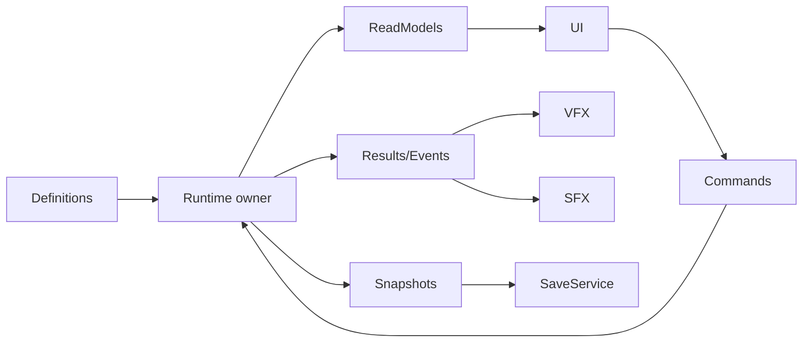

# KISS, SOLID и single entry point

## 1. KISS

KISS означает выбрать самую простую архитектуру, которая корректно покрывает текущие требования.

Это не «минимум строк». Простое решение:

- имеет понятного owner;
- показывает data flow;
- тестируется;
- корректно обрабатывает lifecycle и ошибки;
- не создаёт speculative abstractions;
- не скрывает обязательную сложность.

### Правила

- Решать заявленную mechanic, не гипотетический framework.
- Начинать с direct dependency и concrete owner.
- Добавлять interface только для реальной boundary/вариантов.
- Добавлять service только при самостоятельной ответственности и lifecycle.
- Оставлять actor state на actor.
- Использовать pure function/helper для formulas/validation без state.
- Не создавать manager на каждое существительное.
- Не создавать generic event bus, если direct event/result достаточен.
- Не делать Addressables/mod/ECS/cloud shape частью Basic заранее.
- Ошибка required path — explicit blocker, не fallback.

### Примеры

| Задача | KISS решение | Лишнее решение |
| --- | --- | --- |
| 3 reward choices | inter-wave owner + pure roller | deck/card framework |
| Tower damage | Tower/weapon → receiver | global CombatManager |
| Shield одного Enemy | state in receiver | global ShieldManager |
| Several aura emitters | local AuraEmitter | AuraManager per aura |
| Flying Enemy | second movement implementation | FlyingWave/Economy systems |
| Auto-repair Tower | Tower durability-owned timer | RepairManager |
| Save between waves | snapshots + SaveService | mutable SaveSession mirror |

## 2. SOLID

SOLID — набор ориентиров, а не требование создать много interfaces/classes.

### 2.1 SRP — Single Responsibility

Тип имеет одну cohesive responsibility и одну главную причину изменения.

Применение:

- RunFlow меняет global phase, не spawn-ит Enemy.
- WaveFlow выполняет schedule, не хранит currency.
- RunEconomy меняет balance, не решает upgrade eligibility.
- Map owner хранит committed topology, не UI preview.
- SaveService пишет DTO, не рассчитывает reward.
- Profile owner меняет meta progression, не active run.
- VFX/SFX показывают result, не создают его.

SRP не требует вынести HP, MaxHP и DamageTaken в три components.

### 2.2 OCP — Open/Closed

Stable behavior расширяется через data/strategy там, где реально есть варианты.

Применение:

- Tower/Enemy/Reward variants через Definitions;
- Weapon delivery через replaceable implementations;
- Ground/Flying через movement implementations;
- status/reward effects через strategies;
- content providers через direct/Addressables/mod boundary.

Если вариант один, direct implementation лучше speculative interface.

### 2.3 LSP — Liskov Substitution

Implementation может заменить другую без нарушения base contract.

Применение:

- GroundMovement и FlyingMovement одинаково инициализируются, сообщают progress/arrival и останавливаются terminal;
- weapons доставляют DamagePacket и не присваивают себе reward;
- content providers возвращают Definition либо explicit error;
- pools/factories возвращают complete initialized actor либо failure.

FlyingMovement не обязана иметь NavMeshAgent: это нарушило бы abstraction, ориентированную на Ground detail.

### 2.4 ISP — Interface Segregation

Consumer получает только нужный contract.

Применение:

- UI получает command/query endpoints, не full mutable owner;
- Projectile получает pool-return endpoint, не whole pool internals;
- Enemy получает Base arrival target/terminal endpoint, не RunFlow owner;
- application meta получает RunResult, не scene graph;
- VFX получает CueRequest, не DamageReceiver.

### 2.5 DIP — Dependency Inversion

High-level policy не зависит от unstable low-level detail.

Полезные boundaries:

- storage gateway;
- content provider;
- scene loader;
- clock/random when deterministic tests/save require;
- weapon/movement variants;
- platform settings/input persistence.

Между двумя stable concrete scene owners direct reference допустима. Interface без второго implementation/test boundary не обязателен.

## 3. Single entry point

### 3.1 Зачем

Single entry point гарантирует:

- один порядок initialization;
- одну validation boundary;
- одну cancellation/rollback chain;
- отсутствие duplicate run/wave;
- понятное место ошибки;
- deterministic restore.

### 3.2 Уровни entry

```text
ApplicationRoot.StartApplication
  → GameplayEntryPoint.StartNewRun | ContinueRun
    → RunFlow.StartWave
      → WaveFlow.ExecuteWave
```

Каждый уровень владеет своей state transition. Внутренние callbacks сообщают Results/Events вверх, но не вызывают sibling entry заново.

### 3.3 GameplayEntryPoint contract

```text
Input: StartingRules XOR RunSaveDTO
Dependencies: content/save/application endpoints + authored scene graph
Output: Ready(Preparation) OR BlockingError
```

Порядок:

1. validate;
2. create/restore state;
3. map/navigation;
4. Base/spawn;
5. owners/actors;
6. views;
7. invariant check;
8. Preparation.

### 3.4 Что не является entry point

- `Awake`/`Start` actor component;
- HUD button handler;
- Enemy spawn anchor;
- VFX animation event;
- Save deserializer callback;
- static `Instance` getter;
- `OnEnable` retry;
- editor helper.

Они могут подготовить local object или отправить Command владельцу.

## 4. Ownership

### Один mutable owner

| State | Owner |
| --- | --- |
| Global run phase | RunFlow |
| Wave cursor/active Enemy set | WaveFlow |
| Run balance | RunEconomy |
| Meta balance/unlocks | Profile owner |
| Map topology/occupancy | Map owner |
| Tower state | Tower root/local modules |
| Enemy HP/terminal | Enemy receiver/root |
| Enemy movement | exactly one movement implementation |
| Base HP/terminal | Base owner |
| Effect instances | receiver |
| Aura membership | emitter; receiver owns applied value |
| Save file | SaveService stores snapshot; domain owner remains runtime truth |

Snapshot, ReadModel, UI label, ledger row и cache не становятся owners.

## 5. Data direction



Обратные запрещённые направления:

- UI → direct field mutation;
- VFX/SFX → authoritative damage/reward;
- SaveService → gameplay methods during deserialization;
- Definition asset ← runtime mutation;
- actor → ProfileSave;
- map → StartWave.

## 6. Dependency composition

### Same object

Use authored topology + local component lookup/cache. Do not serialize same-object reference without reason.

### Child object

Use serialized Transform/component references or authored sockets. Runtime search by name/path is not contract.

### Scene/run dependency

GameplayEntryPoint passes direct reference/endpoint or DI composition. Leaf actor does not scene-search service.

### Dynamic contributor

Register/unregister with registry/service. Registry does not own contributor state.

### Cross-scene/application

Use immutable payload, provider for one current scene view only when necessary, or application gateway. Avoid persistent stale MonoBehaviour reference.

## 7. Lifecycle symmetry

Required pairs:

```text
create ↔ destroy
rent ↔ return
register ↔ unregister
subscribe ↔ unsubscribe
load handle ↔ release
apply effect ↔ remove
start task ↔ cancel/complete
begin transaction ↔ commit/rollback
save snapshot ↔ load/apply
```

Asymmetry usually creates duplicated event, stale target, leaked handle, repeated reward or dirty state after pooling.

## 8. No fallback

Fallback — скрытая замена requested primary path другим behavior.

Запрещено:

- missing Definition → default object;
- Addressables fail → Resources;
- missing spawn → origin;
- invalid save → new run;
- missing owner → `FindAnyObjectByType`;
- pool fail → Instantiate;
- invalid Flying route → Ground route;
- required offer/tile phase fail → skip;
- profile write fail → PlayerPrefs;
- missing component → runtime AddComponent.

Optional feature отсутствует только по explicit Rules/Definition. Это не fallback.

## 9. Architecture decision test

Перед новым class/interface/service/component ответить:

1. Какой player-facing requirement?
2. Кто владеет mutable state?
3. Какой scope/lifecycle?
4. Есть ли существующая cohesive boundary в greenfield model?
5. Нужен ли Unity callback/Transform/Inspector?
6. Можно ли сделать pure function/owned plain object?
7. Есть ли две реальные implementations/consumers?
8. Как dependency передаётся?
9. Как command/result/event движутся?
10. Как save/restore работает?
11. Где cancellation/cleanup?
12. Как failure выглядит без fallback?

Если тип только пересылает вызов или копирует state, он не нужен.

## 10. Антипаттерны

- manager/service per noun;
- giant mutable GameContext;
- global singleton/service locator;
- UIDataService как mirror owners;
- generic event bus для локальных calls;
- mutable ScriptableObject runtime state;
- SaveSession mirror of run;
- `Ensure...`/lazy repair paths;
- runtime component composition;
- two movement components changing one Enemy transform;
- Flying-specific duplicate wave/economy;
- general framework before Basic mechanic.

## 11. Definition of done architecture

- single entry point identified;
- one mutable owner per state;
- responsibilities cohesive;
- interfaces justified;
- data direction explicit;
- lifecycle symmetric;
- no runtime topology repair;
- no fallback;
- Ground/Flying and road-contact/repair impacts covered;
- save and presentation boundaries covered;
- numeric and Play Mode validation path defined.

